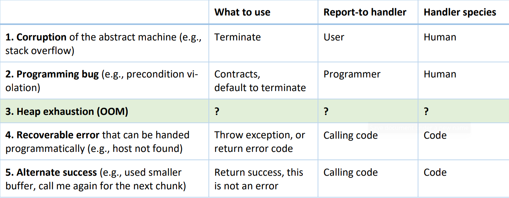

`bad_alloc`

Ceci n'est pas une exception.
<!-- .element: class="fragment" -->

---

How many execution paths?

```cpp
auto evaluate_salary(Employee e) -> std::string
{
  if (e.title() == "CEO" || e.salary() > 100000)
  {
    std::cout << e.first() << " " << e.last() << " is ..\n";
  }

  return e.first() + " " + e.last();
}
```

Note:
How many execution paths are in this function?

2?

Between 2 and 10?

Between 10 and 20?

---

# 23

Note:
3 plain execution paths and 20 hidden paths.

---

```cpp
auto evaluate_salary(Employee e) -> std::string
                              ^     ^
{
  if (e.title() == "CEO" || e.salary() > 100000)
             ^   ^  ^    ^          ^  ^  ^
  {
    std::cout << e.first() << " " << e.last() << " is ..\n";
              ^         ^  ^      ^        ^  ^
  }

  return e.first() + " " + e.last();
                ^  ^  ^  ^       ^
}
```

Note:
There is no good way to reason about this.
Thinking about each of these paths when developing software is not what you
want to do. It's neither practical nor reasonable.

Imagine writing tests for every execution path, as you should.
Essentially `bad_alloc` is doing this to your code.

---

The 3 types of `bad_alloc` aware programs:

* Does not care | root exception handler + RAII
<!-- .element: class="fragment" -->

* Believes it handles `bad_alloc` aware, but doesn't really
<!-- .element: class="fragment" -->

* Actually handles allocation failure
<!-- .element: class="fragment" -->

Note:
The 3 types of `bad_alloc` aware programs:

Your program is probably in the this first category, and that is totally fine.

The vast majority of programs that claim to handle `bad_alloc`,
do so without testing for it, or in an incorrect way.
Correctly noticing and handling allocation failure is exceedingly tricky.
There are systems where reliably catching `bad_alloc` is essentially impossible.

Then there is a handful of programs that actually handle allocation failure in
a reliable way. And nearly none do so with fine grained catch `bad_alloc`.

---

"... if STL switched to making bugs [logic errors, domain errors] be contracts ... and we could make bad_alloc fail fast, we could use the standard STL unmodified throughout Windows."

\- Pavel Curtis, private communication

---



Note:
When looking at different kinds of failure.

Is heap exhaustion like all other errors, or should it be treated specially?

- Unlike case 1 (e.g., stack exhaustion), a heap allocation is always explicitly requested by a function in its source code, and so in principle the function or its caller could always test and attempt to respond to the failure.
- Unlike case 2, a heap allocation is not a programming bug because the programmer cannot in general test in advance whether it will fail before attempting the heap request.
- Unlike case 5, a heap allocation failure is not a form of success (by definition).

---

Ceci est une exception.

Note:
Arguments against treating heap exhaustion separately from other errors include:

- It is an explicit fallible request in source code.
- Some (possibly lots) of code is correct today for heap exhaustion even without coding for it specially.
- Some alternatives exist.

---

Ceci n'est pas une exception.

Note:
Arguments in favor of treating heap exhaustion specially from other errors include:

- Testing is much more difficult.
- Recovery requires special care. Most code that thinks it handles
heap exhaustion is probably incorrect.
- In many programs, heap allocation failure can never happen as required by the standard (i.e., today's C++ heap allocation semantics are unimplementable or unused).
- Reporting preference is often different.
- We have some precedent in the C++ standard for treating heap exhaustion differently from other errors.
- Contracts and heap exhaustion combined outnumber all other failure conditions by roughly 10:1.
- Treating heap exhaustion the same as all other errors violates the zero-overhead principle by imposing overheads on all C++ programs.

---

Herb Sutter:

Zero-overhead deterministic exceptions: Throwing values

http://www.open-std.org/JTC1/SC22/WG21/docs/papers/2018/p0709r0.pdf

Note:
What do you think, should `bad_alloc` be treated
like all other dynamic exception or not?

For a more detailed discussion about this topic read Herb Sutters paper called
'Zero-overhead deterministic exceptions: Throwing values'.

---

## Thanks
