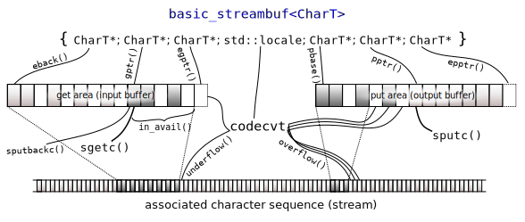

`fake-std`

Note:
I use cppreference quite a bit, and have come across some rather obscure corners of C++ over the years.

---

`do_in`

`std::codecvt<InternT,ExternT,State>::do_in`
<!-- .element: class="fragment" -->

Note:
Is this a real function in the standard library?

Yes, a member function of `codecvt`. The documentation says 'translates the external characters from the source range [...] to internal characters.'

---

std::codecvt::do_in  
std::codecvt_utf8::do_in  
std::codecvt_utf16::do_in  
std::codecvt_byname::do_in  
std::codecvt_utf8_utf16::do_in  
<!-- .element: class="fragment" -->

std::ctype::do_is  
std::ctype_byname::do_is
<!-- .element: class="fragment" -->

`<locale>`
<!-- .element: class="fragment" -->

Note:
Obviously this is not the only version of this.

`utf8_utf16` I don't even know what that means.

Not to be confused with `do_is`.

So where does one find such beauty? `<locale>` of course.

---

`EILSEQ`

Illegal byte sequence
<!-- .element: class="fragment" -->

`<cerrno>`
<!-- .element: class="fragment" -->

Note:
On to our next little nugget. Anyone an idea what this is?

A macro constant signaling 'Illegal byte sequence'.

---

`mbsrtows`

<?>

Note:
Well, this one is fake. No one would name a function like that.

---

`mbsrtowcs`

cmlwtkntotbckashtcase
<!-- .element: class="fragment" -->

`<cwchar>`
<!-- .element: class="fragment" -->

Note:
This one isn't. It's a free function that 'Converts a null-terminated multibyte character sequence, to its wide character representation'.

And now to tie it all together. If we call `mbsrtowcs`, multi byte string to wide character string, is my best guess and I'd don't know what the r stands for.

I like calling this the camel was taken to the back and shot case.

So if we call this on a state provided to `do_in`, the function might set `EILSEQ` in errno. Beautiful isn't it.

---

`c8rtomb`

Coming C++20
<!-- .element: class="fragment" -->

`<cuchar>`
<!-- .element: class="fragment" -->

Note:
On to equally well named things. You might say, well they gave things questionable names in the past, and now they've learned their lesson and are doing a better job now. Nope, this one is a C++20 addition. The documentation says 'Converts a single code point from UTF-8 to a narrow multibyte character representation.' My best guess is, char8 to multi byte, again no idea what the r stands for.

---

`rel_ops`

Deprecated C++20
<!-- .element: class="fragment" -->

// ??, pair
<!-- .element: class="fragment" -->

`<utility>`
<!-- .element: class="fragment" -->

Note:
Has anyone here heard of this before?  
Let's start with the documentation 'Given a user-defined operator== and operator< for objects of type T, implements the usual semantics of other comparison operators.' Sound familiar? Well they are a poor mans spaceship.  
Deprecated in 20.  
I was curious when was this added? Because it seems this feature has so little widespread knowledge and use, that there is a paper from 2013 called 'Ruminations on relational operators', and it doesn't mention this once. So I went digging and the earliest I found was a paper called 'Concepts for the C++0x Standard Library: Utilities'. Oh it's from 2006. Guess this is what is left of the OG concepts. Also in that paper a lovely section right next to `rel_ops` titled ?? pair. This thing is older than pair.

---

`isgraph`

`<cctype>`
<!-- .element: class="fragment" -->

Note:
Let me blow your mind, did you know C++ comes with a graph library build in? Ok, I'm kidding, this checks if the given character has a graphical representation.

Can be found in copyright type.

---

`strpbrk`

`<cstring>`
<!-- .element: class="fragment" -->

Note:

String P-Break? String pointer break? You know how translation websites have a little audio button, that plays a pronunciation of the words, I think we need one of those on cppreference too.

This is a kind of a c style find any of in a byte string.

---

`messages_byname`

`<locale>`
<!-- .element: class="fragment" -->

Note:
Are we doing some message passing, or wait is it `locale` again? Who thinks this is `locale` again?

It's a facet for looking up translations.

---

`undeclare_reachable`

`<memory>`
<!-- .element: class="fragment" -->

Note:

This is my favorite discovery, has anyone here seen this before? And I promise it's not locale.

This is from C++'s garbage collection module. Now I know what you are thinking, wait C++ doesn't have garbage collection, well not quite, but it has an ISO standardized gc interface since C++11. Let's read the first sentence of ISO WG21 paper N2670, 'This is a proposal to implement the "Kona garbage collection compromise"', so back in 2007 some people wanted to add automatic memory management to the language, and the compromise they settled on was, let's add a gc interface to the language and let users implement it, and let's not use in anywhere else.

---

`get_pointer_safety`

`<memory>`
<!-- .element: class="fragment" -->

Note:
Of course once you have a gc, you also need to know exactly how safe your pointers are, because after all, C++ always let's you choose how correct, ehmm, I meant how safe, your program should be.

---

`undeclare_no_pointers`

`declare_no_pointers`
<!-- .element: class="fragment" -->

`<memory>`
<!-- .element: class="fragment" -->

Note:

Ok, this can't be real right?

It kind of makes sense if you know the accompanying function. First you declare a region of bytes no longer contains traceable pointer locations, and then you can undeclare that later again.

---

`get_money`

`<iomanip>`
<!-- .element: class="fragment" -->

Note:
Is the standard trying to tell us something? I tried calling it with my IBAN and somehow it raised a funds not sufficient exception, not sure what happened there.

And while it does use the `money_get` facet of `locale` this one is part of `iomanip`.

---

`showmanyc`

<!-- .element: class="fragment" -->

`<streambuf>`
<!-- .element: class="fragment" -->

Note:
If you look at it closely and imagine a 'how' in there, you can guess what it does. This function tells you how many characters it guess there are left in the input stream.

Also I found this found this wonderful picture about how 'basic' streams buffers work in C++. Note how it also features our good old friend `codecvt` from `locale`. The string theory people could really learn something from the C++ committee.

---

`indirect_array`

`gslice_array`
<!-- .element: class="fragment" -->

`slice`
<!-- .element: class="fragment" -->

`<valarray>`
<!-- .element: class="fragment" -->

Note:
To be honest, even with looking at the documentation, I don't quite fully get how this works. My best guess is, when you subset slice `valarray`s with a `gslice` and subscript operate that you get a `gslice_array`. Same if you index into a `valarray` with a `valarray` of index types you also get a `gslice_array`, which allows a kind of NumPy style indexing.

Also if you ever wondered why we got `span` and not `slice`, because we already have `std::slice`, but it only works with `vallarray`s.

---

`assume_aligned`

`<memory>`
<!-- .element: class="fragment" -->

Note:
Another 20 addition, that 'Informs the implementation that the object ptr points to is aligned to at least N'.

---

`assume_no_ub`
<!-- .element: class="fragment" -->

`assume_const`
<!-- .element: class="fragment" -->

`assume_sfinae`
<!-- .element: class="fragment" -->

Note:
I kind of want more functions like this.

---

`hardware_destructive_interference_size`

`hardware_constructive_interference_size`
<!-- .element: class="fragment" -->

`<new>`
<!-- .element: class="fragment" -->

Note:
This function tells you how big your hammer has to be, to interfere with your running C++ programs.

What you are seeing is someones attempt of saying cache size, without using the word cache. Obviously C++ is only concerned with the abstract machine, and the abstract machine needs no silly things like caches.

I'm still baffled they made this `constexpr`. In the notes is says 'These constants provide a portable way to access the L1 data cache line size.', wait how is it portable if you bake it in during compilation? Also to my knowledge even though this is a C++17 addition no stdlib I know of has implemented this yet.

---

~Comments~

## Questions

---

Thanks
