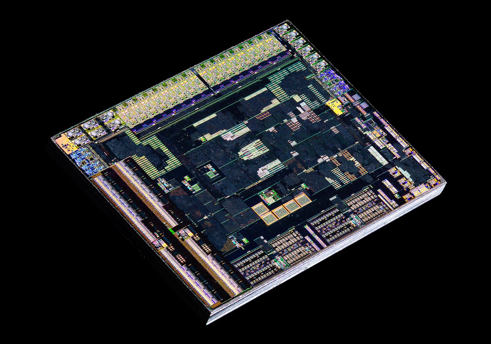
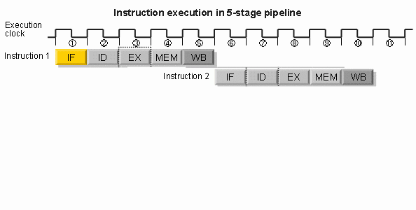
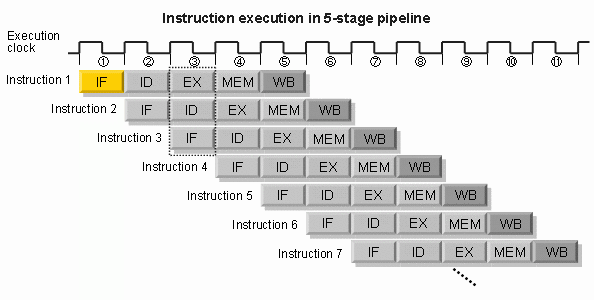
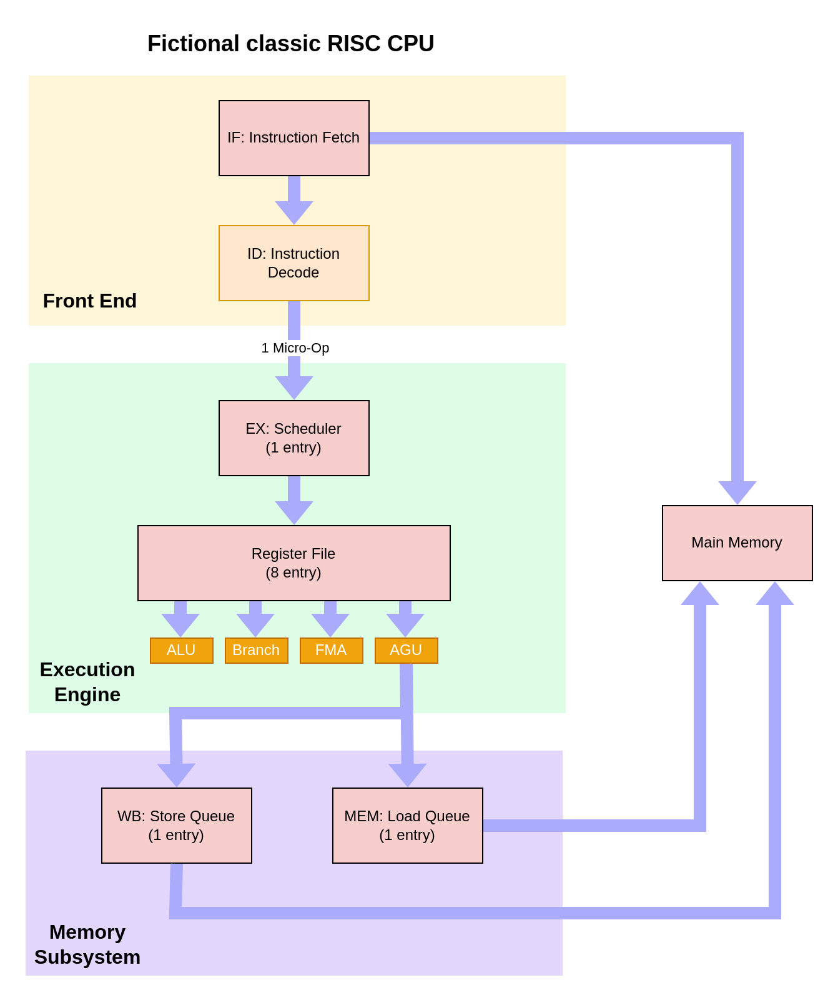

#### Your mental model about branch prediction is wrong.

---

TODO maybe music? Change FOSS and Rust enthusiast.


<!-- **About myself**

- FOSS and Rust enthusiast
- Loves reading Sci-Fi
- Enjoys board games and cooking
- Terrible at whistling
- Cannot drive cars
- Works for MVTec Software GmbH

-->

---

Your mental model about branch prediction is wrong.

My mental model about branch prediction is wrong.
<!-- .element: class="fragment" -->

---

**All** models are wrong,

**but** some are useful.
<!-- .element: class="fragment" -->

Note:
- Newton example F = M * A, Apple falling from 2m -> Air resistance,
  Gravitational field variation etc. -> wrong by milliseconds.
  Takes ~0.6 seconds to fall.
- Newton is wrong, but also useful for some situations.
  Useless for quantum particle interaction.

---

**Overview**

1. Exploration of branch prediction.
2. A new way to think about branch prediction.
3. Why does it matter?
4. Recap.

Note:
- Exploration of real effects of branch prediction, and how they match the
  common mental model.
- I'm proposing a different mental model that is also wrong, but can explain
  modern hardware much better.
- Why should you care?
- Recap.

---

**Why** does it matter?

> In x86 you usually see a branch instruction every 6 instructions with a taken
> branch every 12 instructions [...] - Stephen Robinson, Intel Fellow and Lead
> Architect for Intel’s E-cores (2024)

Note:
- So these branch things are quite common.

---

**What** is branch prediction?

Note:
- Why have CPU designers implemented branch prediction for more than 40 years?
- Short answer, it's an optimization to work around issues introduces by another
  optimization.

---

TODO wikipedia

---

TODO simple wrong model of speculative execution that always happens in execute
stage.

---

TODO experiments with goto

---

**Test machine**

```
Linux 6.8
clang version 17.0.6
AMD Ryzen 9 5900X 12-Core Processor (Zen 3 micro-architecture)
CPU boost enabled.
```

Note:
- Released at the end of 2020

---

TODO explain perf.

---

show code and assembly with arrows.

* Oh that is a branch.
* 1k swap vs shuffle
* 4k swap vs shuffle
* 16k swap vs shuffle
* 260k swap vs shuffle

* jump count 22 vs 26 30 ms vs 170 ms
* 

---



Note:
- Hardware is complex and diverse.
- Measuring is always important.

---

**CPU optimizations**

- Pipelined execution
- Superscalar execution
- Out-of-order execution
- Speculative execution
- ...

Note:
- The three core characterizing aspects of most low-to-high power designs today
  are pipelined, superscalar and out-of-order execution.
- The whole point is to execute a stream of instructions as fast as possible.
- Focus instruction-per-clock (IPC) improvements, not multi-threaded or system
  architecture optimizations.

---

Pipelined execution

---



Note:
- Different phases in a CPU to execute instructions:
  * IF: Instruction Fetch, load the instructions from memory
  * ID: Instruction Decode, decode the ISA encoded instructions into a form
    understood by the hardware.
  * EX: Execute, do the logic, i.e. add two numbers,  etc.
  * MEM: Memory access, load memory into registers.
  * WB: Register write back, store memory from registers to memory.
- If your CPU executes each stage of its pipeline sequentially, branch
  prediction is pointless.
- Original 8086 was like this.
- Common x86 designs have 11-12 stages.
- The shown stages don't map exactly onto modern design.
---



Note:
- Optimization, run the different phases of the pipeline in parallel.
- Aka. instruction pipelining.
- In the same time it took the non-pipelined design to finish 2 instructions,
  this imaginary pipelined design can do 6.
- First designs in the 1970s.

---

Pipeline hazards

Note:
- Pipelined execution introduces a new problem.

---

TODO visualize pipeline hazard.

---



Note:
- A fictional 5GHz CPU *without* pipelined, superscalar, out-of-order,
speculative execution.

---

**Fictional CPU**

* IF: Loads instructions from main memory `~200 cycles`
* ID: Decodes instructions `~3 cycles`
* EX: Execute the logic `~2 cycles`
* MEM: Load data from main memory `~200 cycles`
* WB: Store data from registers to main memory `~200 cycles`

Note:
- Each instruction takes ~600 cycles.
- This is known as the memory wall. The logic clocks so much faster than the
  latency to main memory.
- Modern designs can sustain multiple instructions per cycle, with IPC of
  regular programs often above one. Versus this fictional design, they are 1000x
  times faster.
- Ignored virtual memory, because TLBs also require caching.

---

TODO branch prediction

---

TODO show hardware Zen 3 and A57 Switch CPU

Zero bubble
Loop unrolling Intel, u-op cache. Small loop.

---


Mental model TODO:

View a CPU core as asynchronous components that feed each other with queues.

Bottlenecks can happen everywhere in the system. By being asynchronous the design tries to hide bottlenecks in other parts by continuing work elsewhere. It's expected that all components will have to wait at some point.

Frontend: Typically stalled because of slow or wrong branch decisions, or instruction fetch latency. Examples?
Backend: Typically stalled because of a lack of resources. Examples?

For example if the floating point FMA units in the backend are starting to fill up with work and can't keep up, the frontend can 

Peak performance is achieved when the narrowest pipe is fully utilized at all times. In most modern designs that's the rename/allocate stage.

---

Language constructs that are affected by branch prediction:

```cpp
- if
- &&
- ||
- ?
- for
- while
- break
- continue
- goto
- return
- switch
- function call
- function pointer call
- virtual function call
```

Note:
- Assumes the compiler didn't optimize the branch away.
- Return is double kind of prediction, branch to ret and return stack predictor

---

Maybe group language constructs by the kind of prediction:

- Is a branch

```cpp
- break
- continue
- goto
- function call
```

- Is a branch and conditional history

```
- if
- &&
- ||
- ?
- for
- while
- switch
```

- Is a branch and target history

```
- return
- function pointer call
- virtual function call
```

Can be combined `if (cond) return;`, `if (cond) (*f_ptr)();`.

---

Lessons:

- Modern CPUs try very hard to extract parallelism from linear streams of instructions.
- Modern CPUs try very hard to work around the latency of having to wait 300+ cycles for main memory.

---

Links:

- Sort research repo https://github.com/Voultapher/sort-research-rs
- Talk repo https://github.com/Voultapher/Presentations

---

Thank You ❤️

---

Questions?