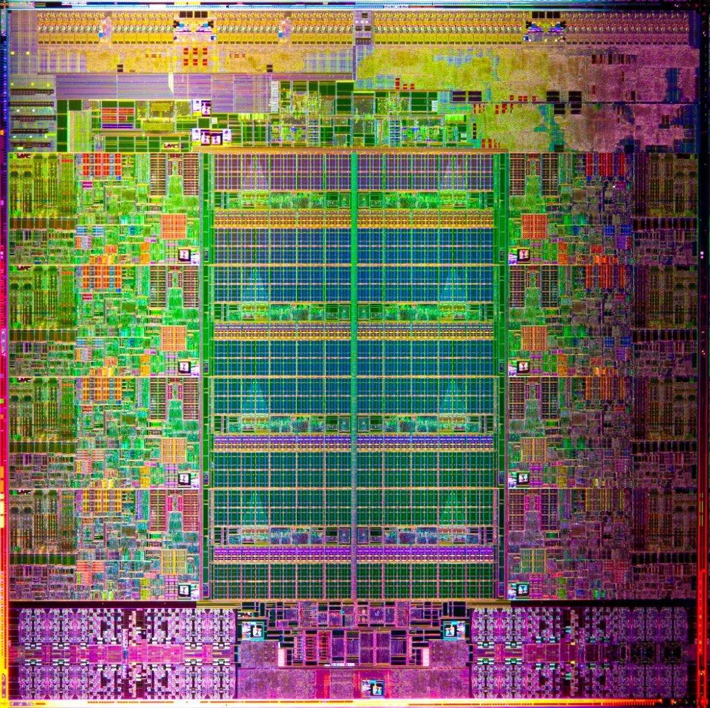
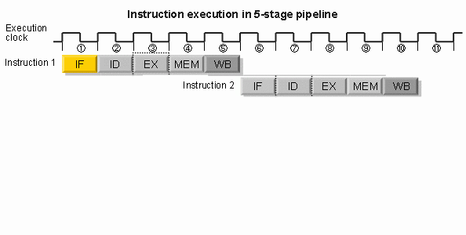
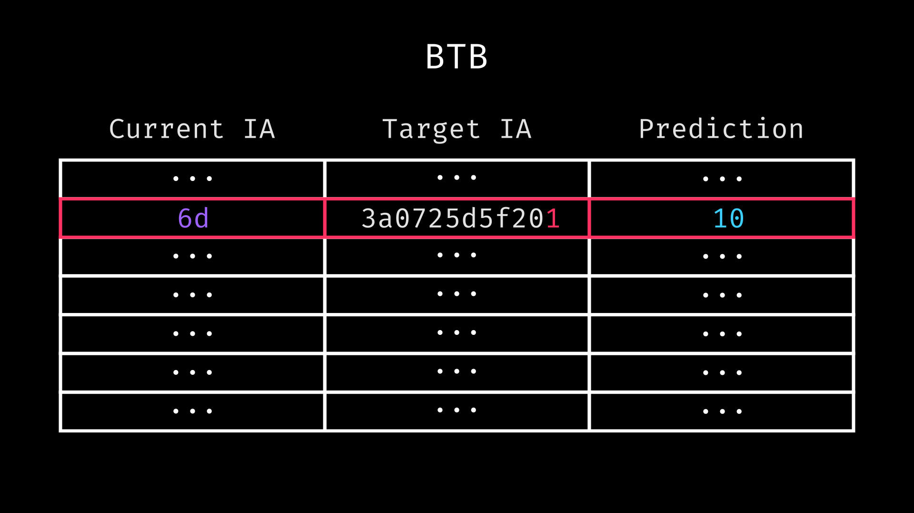

---

`retpoline`

From Light Switch to Compiler Switch

Note:
- disclaimer
- represent my own views
- talk about security
- vast complex topic
- only slice
- not expert
- probably wrong in some way
- let's go

---


Note:
- solid state physics + molten sand
- shrink 10 million times
- same functionality, electricity flow, not flow
- imagine flipping with finger

---


Note:
- stick together == logic gate
- little triangles == transistor

---



Note:
- stick logic gates together == CPU
- gross simplification

---

https://godbolt.org/z/RVTfSS

---

```x86asm
mov     eax, dword ptr [rdi]
add     eax, 3  
ret
```

Note:
- machine language 101
- mov, move memory from this location to that location
- add, add that number to that register
- ret, return from the function call

---

cycle 1

```x86asm
-> mov     eax, dword ptr [rdi]
   add     eax, 3
   ret
```

---

cycle 2

```x86asm
   mov     eax, dword ptr [rdi]
-> add     eax, 3
   ret
```

---

cycle 3

```x86asm
   mov     eax, dword ptr [rdi]
   add     eax, 3
-> ret
```

Note:
- how could a CPU execute this faster?

---


Note:
- let's flick the switch faster

---


---


---


Note:
- decreasing delta
- everything faster

---


Note:
- the faster we go
- the more power we leak

---


Note:
- oh no

---

We can't flick the switch any faster!?!

---

cycle 1

```x86asm
-> mov     eax, dword ptr [rdi]
   add     eax, 3
   ret
```

Note:
- ignored memory latency
- mov, location in rdi in main memory

---

cycle 141

```x86asm
   mov     eax, dword ptr [rdi]
-> add     eax, 3
   ret
```

Note:
- oops had to wait 140 cycles
- not even worst case

---

cycle 142

```x86asm
   mov     eax, dword ptr [rdi]
   add     eax, 3
-> ret
```

Note:
- how could a CPU execute this faster?

---


Note:
- mining stone
- have to go all way
- what if

---


Note:
- add resource depot next to it
- not go all the way
- could even call cache

---

cycle 1

```x86asm
-> mov     eax, dword ptr [rdi]
   add     eax, 3
   ret
```

Note:
- try again with cache

---

cycle 11

```x86asm
   mov     eax, dword ptr [rdi]
-> add     eax, 3
   ret
```

Note:
- if things go well, not perfect
- now only 10 cycles
- reality more complex

---

cycle 12

```x86asm
   mov     eax, dword ptr [rdi]
   add     eax, 3
-> ret
```

---

- IF = Instruction Fetch,
- ID = Instruction Decode
- EX = Execute
- MEM = Memory access
- WB = Register write back

Note:
- single instruction more complex
- broken down into micro ops(operations)
- example how can be broken down

---



Note:
- if that our CPU

---

cycle 1

```x86asm
-> mov     eax, dword ptr [rdi]
   add     eax, 3
   ret
```

---

cycle 16

```x86asm
   mov     eax, dword ptr [rdi]
-> add     eax, 3
   ret
```

Note:
- if things go well now only 10 cycles
- reality more complex

---

cycle 21

```x86asm
   mov     eax, dword ptr [rdi]
   add     eax, 3
-> ret
```

Note:
- each instructions 5 cycles

---

How could a CPU execute this faster?

---


Note:
- pipelining
- with only one each unit
- keep every part of the processor busy

---


Note:
- ~2005 clock speeds stall
- wait what is this
- look at the fine print
- original 2005, updated to 2016
- I don't have a 28GHz CPU
- maybe not trust 'The Singularity Is Near: When Humans Transcend Biology.'

---


Note:
- more credible source
- around 2005 clock speed & thermal design power plateau
- notice keep shoving more transistors into chips

---


Note:
- another source shows similar
- what are they doing with all these transistors

---

IPC (Instructions Per Cycle)

```x86asm
mov     eax, dword ptr [rdi]
add     eax, 3
ret
```

```
c1, c2, c3     -> 3ins / 3c   -> 1 IPC
c1, c141, c142 -> 3ins / 142c -> 0.021 IPC
c1, c11, c12   -> 3ins / 12c  -> 0.25 IPC
```

Note:
- measurement unit IPC

---


---


Note:
- can't improve clock frequency
- demand improve IPC

---


Note:
- not wrong
- programmer fault CPU has to wait

---


- we demand more IPC!

---


Note:
- sigh
- here you go
- don't ask how we did it

---


Note:
- more transistors == more IPC
- how
- can see 'oh no' around 2005

---

https://godbolt.org/z/N-kEji

Note:
- runtime condition
- runtime branch

---

cycle 1

```x86asm
-> test    rdi, rdi
   je      .LBB0_1
   mov     eax, dword ptr [rdi]
   add     eax, 3
   ret
   .LBB0_1:
   mov     eax, 66
   ret
```

Note:
- bitwise & at memory location rdi
- load from memory or cache

---

cycle 11

```x86asm
   test    rdi, rdi
-> je      .LBB0_1
   mov     eax, dword ptr [rdi]
   add     eax, 3
   ret
   .LBB0_1:
   mov     eax, 66
   ret
```

Note:
- if all zero jump to label
- only know where to go once memory loaded

---

cycle 14

```x86asm
   test    rdi, rdi
   je      .LBB0_1
   mov     eax, dword ptr [rdi]
   add     eax, 3
   ret
   .LBB0_1:
-> mov     eax, 66
   ret
```

Note:
- jumping also costs cycles
- what if

---

What If?

---


---

We&nbsp;~play poker~&nbsp;guess?

---

cycle 1

```x86asm
-> test    rdi, rdi
   je      .LBB0_1
   mov     eax, dword ptr [rdi]
   add     eax, 3
   ret
   .LBB0_1:
   mov     eax, 66
   ret
```

---

cycle 4

```x86asm
   test    rdi, rdi
   je      .LBB0_1
   mov     eax, dword ptr [rdi]
   add     eax, 3
   ret
   .LBB0_1:
-> mov     eax, 66
   ret
```

Note:
- instead of waiting
- guess the branch outcome

---

cycle 4

```x86asm
   test    rdi, rdi
   je      .LBB0_1
-> mov     eax, dword ptr [rdi]
   add     eax, 3
   ret
   .LBB0_1:
   mov     eax, 66
   ret
```

Note:
- could also be
- could also not take branch speculatively

---

cycle 5

```x86asm
   test    rdi, rdi
   je      .LBB0_1
   mov     eax, dword ptr [rdi]
-> add     eax, 3
   ret
   .LBB0_1:
   mov     eax, 66
   ret
```

Note:
- rdi already loaded into the register
- add 3

---

cycle 6

```x86asm
   test    rdi, rdi
   je      .LBB0_1
   mov     eax, dword ptr [rdi]
   add     eax, 3
-> ret
   .LBB0_1:
   mov     eax, 66
   ret
```

Note:
- and now
- at some point we'll know if we guessed right
- but what did we win
- to be useful also need something else

---


Note:
- remember the pipeline

---


Note:
- what if

---


Note:
- we made it bigger

---


Note:
- multiple of each unit
- called superscalar

---


Note:
- modern CPU more like
- still very simplified

---


Note:
- more like this
- varying amounts of everything
- complex interconnection and dependencies
- how does this help?

---

https://godbolt.org/z/KeSdKw

Note:
- another pointer as function parameter
- check both for null

---

cycle 1

```x86asm
-> test    rdi, rdi
   je      .LBB0_1
   test    rsi, rsi
   je      .LBB0_3
   mov     eax, dword ptr [rdi]
   mov     ecx, dword ptr [rsi]
   add     eax, ecx
   add     eax, 3
   ret
   .LBB0_1:
   [...]
```

Note:
- first without superscalar
- but with speculative execution

---

cycle 2

```x86asm
   test    rdi, rdi
-> je      .LBB0_1
   test    rsi, rsi
   je      .LBB0_3
   mov     eax, dword ptr [rdi]
   mov     ecx, dword ptr [rsi]
   add     eax, ecx
   add     eax, 3
   ret
   .LBB0_1:
   [...]
```

---

cycle 5

```x86asm
   test    rdi, rdi
   je      .LBB0_1
-> test    rsi, rsi
   je      .LBB0_3
   mov     eax, dword ptr [rdi]
   mov     ecx, dword ptr [rsi]
   add     eax, ecx
   add     eax, 3
   ret
   .LBB0_1:
   [...]
```

Note:
- assume speculate not null

---

cycle ?

```x86asm
   test    rdi, rdi
   je      .LBB0_1
   test    rsi, rsi
-> je      .LBB0_3
   mov     eax, dword ptr [rdi]
   mov     ecx, dword ptr [rsi]
   add     eax, ecx
   add     eax, 3
   ret
   .LBB0_1:
   [...]
```

Note:
- what cycle

---


Note:
- oh no
- still using our only load unit
- have to wait until first load done

---

cycle 11

```x86asm
   test    rdi, rdi
   je      .LBB0_1
   test    rsi, rsi
-> je      .LBB0_3
   mov     eax, dword ptr [rdi]
   mov     ecx, dword ptr [rsi]
   add     eax, ecx
   add     eax, 3
   ret
   .LBB0_1:
   [...]
```

Note:
- first load triggered in cycle 1
- repeat with a superscalar CPU

---

cycle 1

```x86asm
-> test    rdi, rdi
   je      .LBB0_1
   test    rsi, rsi
   je      .LBB0_3
   mov     eax, dword ptr [rdi]
   mov     ecx, dword ptr [rsi]
   add     eax, ecx
   add     eax, 3
   ret
   .LBB0_1:
   [...]
```

---

cycle 2

```x86asm
   test    rdi, rdi
-> je      .LBB0_1
   test    rsi, rsi
   je      .LBB0_3
   mov     eax, dword ptr [rdi]
   mov     ecx, dword ptr [rsi]
   add     eax, ecx
   add     eax, 3
   ret
   .LBB0_1:
   [...]
```

---

cycle 5

```x86asm
   test    rdi, rdi
   je      .LBB0_1
-> test    rsi, rsi
   je      .LBB0_3
   mov     eax, dword ptr [rdi]
   mov     ecx, dword ptr [rsi]
   add     eax, ecx
   add     eax, 3
   ret
   .LBB0_1:
   [...]
```

---

cycle 6

```x86asm
   test    rdi, rdi
   je      .LBB0_1
   test    rsi, rsi
-> je      .LBB0_3
   mov     eax, dword ptr [rdi]
   mov     ecx, dword ptr [rsi]
   add     eax, ecx
   add     eax, 3
   ret
   .LBB0_1:
   [...]
```

Note:
- because we have another load unit
- can keep speculating

---

Melting latency with speculative instruction parallelism

---

no speculation no superscalar

```
c         11 14        24 27
o <--load--><b><--load--><b>
```

Note:
- total 26 cycles

---

speculation no superscalar

```
c  2       11  14
ro *<b>      *<b>
so <--load--><--load-->
```

Note:
- second speculative load stalled by first
- wait until first load done
- total 20 cycles

---

speculation and superscalar

```
c   2  56  9
ro  *<b>*<b>
so1 <--load-->
so2     <--load-->
```

Note:
- speculate in parallel
- total 14 cycles

---

Missing cache both times:

- no speculation no superscalar 286 cycles total
<!-- .element: class="fragment" -->

- speculation and superscalar 144 cycles total
<!-- .element: class="fragment" -->

Note:
- important with bigger latency windows

---

https://godbolt.org/z/uYZGWf

Note:
- instruction level parallelism useful for more than loading in parallel
- if you ever wondered how to compute an orange

---

```x86asm
imul    eax, edi, 22
imul    ecx, esi, 7
imul    edx, edx, 66
shl     rcx, 32
or      rax, rcx
ret
```

Note:
- note all 3 multiplies operate on independent registers

---

no superscalar

```
c     6   11   16
o <mul><mul><mul>so
```

Note:
- total 18 cycles

---

superscalar

```
c      6
o1 <mul>so
o2 <mul>
o3 <mul>
```

Note:
- total 8 cycles
- requires 3 ALUs(Arithmetic Logic Unit)

---


Note:
- earlier talked about prediction

---


Note:
- if you squint you can see ...
- random
- predicting things don't want random

---


Note:
- first mine coal
- then mine oil
- now mine sweet sweet user data
- what if

---


Note:
- build CPU learn from user data
- now that our vc investors are happy can continue
- seriously what if we learn from user behavior

---

https://godbolt.org/z/aHD8Sk

Note:
- simple loop

---


Note:
- wouldn't it be nice
- been taking that branch the last 7 times
- maybe next time same thing happens
- but how?

---

https://godbolt.org/z/aHD8Sk

Note:
- show disassemble

---

```x86asm
.LBB0_1
mov     eax, edi
lea     edi, [rax + rax]
cmp     eax, 43989386
jl      .LBB0_1
ret   
```

```
89 f8 8d 3c 00 3d 8a 39 9f 02  7c   f4 c3
```

```
89 f8 8d 3c 00 3d 8a 39 9f 02 [7c] [f4] c3
                               ^    ^
                               |  relative location
                           short jump
```
<!-- .element: class="fragment" -->

Note:
- maps to this binary representation
- where is the label?
- some point before execution label is replaced with address
- short jump
- relative address
- but where is here?
- relative to what?

---

PC (Program Counter)

Note:
- aka Instruction Pointer
- influenced by things like addressing mode
- encodes instruction address

---

```cpp
auto execute(const vector<Instruction>& program) -> void;
```

Note:
- imagine program as long sequence of operations
- if we emulate this
- how keep track of where we are?

---

```cpp
class X86Cpu {
public:
    auto execute(const vector<Instruction>& program) -> void

private:
    uint64_t rip; // Instruction Pointer aka PC

    uint32_t eax, ebx, ecx, edx, ebp, esi, esp;
    uint64_t rax, rbx, rcx, rdx, rbp, rsi, rsp;
    uint64_t r8, r9, r10, r11, r12, r13, r14, r15;
    std::vector<byte> memory;

    [...]
};
```

Note:
- state kept in registers
- over simplified

---


Note:
- x86 API looks more like this
- in hardware even more complex
- register renaming etc

---


Note:
- instruction pointer index into array of operations
- program probably doing more than just this
- offset random with ASLR
- super wrong

---


Note:
- not where we are
- where are we going next
- here prediction comes into play
- what instruction address to write into PC

---

https://godbolt.org/z/CajGm8

Note:
- first talk about unconditional jumps
- jump always no if, no condition
- fetch jump target location
- jump there

---

https://godbolt.org/z/LsXAiw

Note:
- simpler example
- function pointer is an unconditional jump
- how could we predict this

---


Note:
- remember
- current instruction address
- target instruction address
- what could name be

---


Note:
- branch target buffer
- BTB

---


Note:
- transistors are expensive
- anyone that looked for apartment in Munich knows
- one thing more expensive than transistors

---


Note:
- space
- especially if close to other stuff
- city center
- who am I kidding

---


Note:
- real estate in whole center expensive

---


Note:
- looks a lot like a key value table
- current instruction address is key
- target instruction address is value
- storing full key takes lot of transistors and place
- looking up based on full key takes lot of time
- what if

---

```
0x3a0725d5f201 | 48 bit
   ^ ^ ^ ^ ^ ^
   1 2 3 4 5 6 | bytes
```

48 bit => 8 bit

```
0b001110100000011100100101110101011111001000000001

=>

0bXXXXXX
```

Note:
- shrink current instruction address
- but how

---


Note:
- little hint

---


Note:
- apply to branch target buffer
- only store partial hashed instruction address
- one piece still missing
- conditional branch prediction

---

1 Bit Counter

```
0 = Not Taken
1 = Taken
```

Note:
- could encode taken not taken as single bit
- there is a problem

---


Note:
- lots of fluctuation
- not very stable
- very quickly change mind

---


Note:
- 2 bit saturating counter
- helps reduce flip flopping
- for lower 2 entries predict not taken
- for the upper 2 entries predict taken

---



Note:
- put it all together and you get a BTB
- in modern CPU's more components involved
- core idea is there
- at least many sources describe it that way
- something that happened during research
- again and again

---


Note:
- I'd go in with some vague understanding
- read more and feel like understood it
- then I'd read more
- making what I read before not fit into the big picture anymore
- new question came to mind
- new logic holes open up
- then I'd read more
- things start to make more sense again
- then I'd read more
- for some topics this happened several cycles

---

Static Branch Prediction

```
Intel Pentium 4:
- A forward branch defaults to not taken
- A backward branch defaults to taken
```


Note:
- static prediction if branch not encountered before
- separation into forward and backwards branches
- aka jump to instruction address larger than PC or smaller
- example for Intel
- before all the lakes NetBurst architecture

---

Dynamic Branch Prediction

Note:
- flip side
- dynamic prediction happens if branch encountered before
- remember what happened last times
- look at different types of branches

---


Note:
- 2 axis
- branch conditional?
- target fixed?

- unconditional branch fixed target
- goto, break, continue, etc

- conditional branch fixed target
- if, logical operators, etc

- unconditional branch variable target
- function pointer, virtual call, jump table switch, etc

- conditional branch variable target
- if + functin pointer, etc

---

BTB Unconditional Fixed

```cpp
break;
```

```x86asm
jmp     .LBB0_1
```

Note:
- simplest
- jump to fixed instruction address

---


Note:
- at instruction decode time
- know that jump
- know where to jump
- current instruction address relative or absolute
- part of instruction stream
- no unknown information
- no caching required

---

BTB Conditional Fixed

```cpp
if (x == 38)
```

```x86asm
cmp     eax, 38
jne     .LBB0_1
```

Note:
- most common branch type
- jump to fixed instruction address
- based on runtime condition
- jne, jump (if) not equal

---


Note:
- no need to store the target
- fixed target address part of instruction stream
- look at how history is stored again

---

BHB (Branch History Buffer)

- Local Branch History
<!-- .element: class="fragment" -->

- Global Branch History
<!-- .element: class="fragment" -->

Note:
- split into 2 conceptual parts
- local part
- how has this one specific branch behaved the last N times?
- global part
- how have the last N branches behaved over time?

---

```
N = Not Taken = 0
T = Taken = 1

TNTTTTNTNNTTTTNTNTNTTTNT
101111010011110101011101
```

Note:
- often stored as bit array encoding decisions
- instead of storing saturating counter
- store local and global history

---

```cpp
auto bhb_update(
    uint58_t& bhb_state,
    uint64_t src,
    uint64_t target
) -> void {
    bhb_state <<= 2;
    bhb_state ^= (target & 0x3f);
    bhb_state ^= (src & 0xc0) >> 6;
    bhb_state ^= (src & 0xc00) >> (10 - 2);
    bhb_state ^= (src & 0xc000) >> (14 - 4);
    bhb_state ^= (src & 0x30) << (6 - 4);
    bhb_state ^= (src & 0x300) << (8 - 8);
    bhb_state ^= (src & 0x3000) >> (12 - 10);
    bhb_state ^= (src & 0x30000) >> (16 - 12);
    bhb_state ^= (src & 0xc0000) >> (18 - 14);
}
```

Note:
- reverse engineered
- branch history buffer update logic on Haswell
- no need to fully understand
- take home not only storing taken, not taken
- BHB state also dependent on source and target addresses
- ignore that to keep things easier to manage
- unimportant to understand the fundamental concept

---


Note:
- notice store local branch history for each branch
- store global branch history shared for whole execution
- in global history buffer
- notice not storing hash
- modern BTB store partial address
- lower bits of instruction address
- expectation branches are commonly close together

---

BTB Unconditional Variable

```cpp
fptr();
```

```x86asm
jmp     rdi
```

Note:
- jump to run time variable instruction address
- pretty common
- especially for run time polymorphism
- virtual calls etc
- value pointed to by address stored in rdi
- could be not cached and take a long time to fetch

---


Note:
- left partial current address
- right partial target address
- idea of this cached value
- have a value to work with to keep speculating
- while waiting for target instruction fetch
- usually run time variable jump goes to several different locations
- not much sense if it only goes to one location
- want to store multiple target locations
- but how?

---


Note:
- could store multiple target addresses as value
- variable amount of bits not cool for hardware
- even if
- how to decide which one to pick
- iterating costs lot of time
- have to do better
- what if

---


Note:
- use global history and combine it with lower bits
- idea is
- if program took different path
- other jump target possible
- use BHB entry for disambiguation

---

BTB Conditional Variable

```cpp
if (x == 38) {
    fptr();
}
```

```x86asm
cmp     eax, 38
jne     .LBB0_1
jmp     rdi
```

```x86asm
cmp     eax, 38
je      rdi
```
<!-- .element: class="fragment" -->

Note:
- possible to have both
- runtime condition and runtime variable target
- simple implementation would generate 2 jumps
- jne jump not equal
- if the the value in register eax is not 38
- jump past branch body
- if equal
- jump to location stored in register rdi
- can do better
- combine jumps
- invert condition
- je jump equal
- if equal jump to location in register rdi

---


Note:
- during speculation
- go to BTB
- find out both if you consider it likely
- that branch will be taken
- and where you consider it likely
- that jump will go

---


Note:
- only conceptual
- reality more complex
- more sub components
- shared tables
- more special case handling and hardware

---


Note:
- exceedingly important graph
- 2 axis
- shared
- mutable

---


Note:
- imagine world
- where not shared immutable default
- wouldn't that be nice

---


Note:
- back to this
- 4 combinations
- where do you want to be?
- alternative view

---


Note:
- on the left live is banging
- on the right live not so great
- top right makes believe higher being
- not benevolent
- no
- one with a very fucked up sense of humor
- willing to bet
- vast majority of painful bugs from right

---


Note:
- how much shared mutable state is in your CPU?

---


Note:
- I'm sure nothing bad will happen

---

Ominous music

Note:
- shared between who

---


Note:
- stackoverflow question from 2012
- in there one sub question
- 'What happens to RSB when context switch happens?'
- we'll talk about what an RSB is later
- same day osgx answers 'I think, return stack buffer reseted at context switch.'
- 2 years later Matt G says 'As I understand it, the RSB is unaware of context switches'

---

'will just be "wrong" and mispredict upon context switch'

---

Ominous music

Note:
- will it be just fine
- tune in again next week and find out

---

Thanks

Note:
- wait
- in the age of instant gratification
- do nothing next netflix episode
- do you have the patience to wait?
- let's keep going

---

- Between user and kernel execution on the same CPU
<!-- .element: class="fragment" -->
- Between processes on the same CPU
<!-- .element: class="fragment" -->
- Between guests and their hypervisors
<!-- .element: class="fragment" -->
- Between execution on SMT or CPU siblings
<!-- .element: class="fragment" -->

Note:
- all these can involve shared micro architectural state
- there are more
- this relevant selection

---


Note:
- remember this?
- what if

---


Note:
- we
- attack the table

---


Note:
- bang!

---


Note:
- bang!

---


Note:
- ok maybe too much bang

---


Note:
- as seen before
- BTB kind of hash table
- by combining GHB state and source IA
- key is calculated

---


Note:
- remember GHB is shared across security boundaries
- can be influenced
- imagine executing series of always-taken conditional jumps
- then switch into other security context
- like hypercalling into hypervisor

---


Note:
- oh no

---


Note:
- collision happened
- so what?

---

- Tirich Mir

- Taumatawhakatangihangakoauauotamateaturipukakapikimaungahoronukupokaiwhenuakitanatahu

Note:
(need 2 volunteers)
(give out name paper)
(guess based on paper length)

- layout engine struggling
- I could not see the text
- but saw paper length
- combined with knowing possible options
- visibility obfuscation defeated
- other side channels like holding into light

---


Note:
- for all those thinking I made up a name there
- real place in New Zealand
- digital example

---


Note:
- imagine curious what your sheep do
- know some sheep like installing packages from Ubuntu apt repository
- if exactly one package of exactly 952444 bytes
- and now this one server sends one of your sheeps an encrypted file of 952444 bytes
- hmmm
- what could be inside

---


Note:
- all this called side channel
- often using meta information
- algorithm correct in a vacuum
- implementation creates unintended information channels

---


Note:
- very common side channel
- timing
- how long does something take

- if time data dependent cache access
- address mappings and values


---


Note:
- no one writes code like this

---


Note:
- what if we add speculation

---


Note:
- the branch thing
- it's gonna be fine
- I'll check later
- let me keep on going

---


Note:
- yeah so turns out I speculated wrong
- let me clean up
- never retired any stores I promise
- what about side effects

---


Note:
- fuck

---


Note:
- try to understand how possible
- example memory layout
- 2 arrays
- because bounds check gets ignored speculatively

---


Note:
- load could go to every location after begin of array_1
- look at example

---


Note:
- all values fictional
- user controlled index out of bounds
- bounds check speculated wrong
- initial data dependent index load
- then data dependent value load
- arrows point to where value is in memory
- what's missing?

---


Note:
- what happens to memory that's not in cache yet
- prefetcher loads it into cache

---


Note:
- but why is this a problem
- cache again shared mutable state
- telling you this really is the evil

---


Note:
- via timing side channel
- location of data dependent cache line
- leaks value of first load
- notice scanning through memory region with user_controlled_index
- give moment to follow
- arrows indicate where value is in memory
- what could be done by combining things

---


Note:
- the world is great and peaceful

---


Note:
- oh no

---


Note:
- set up colliding value before switching security context
- need to know collision target address
- leak information from victim to attacker
- influence branch prediction from attacker to victim
- speculatively execute universal read gadget

---

[Stage 1]
1. hypercall -> dump BHB
<!-- .element: class="fragment" -->
2. goto step 1 until address is known
<!-- .element: class="fragment" -->

Note:
- by observing own branch prediction
- leak BHB state of victim

---

[Stage 2]
1. setup BHB for collision -> hypercall
<!-- .element: class="fragment" -->
2. speculatively execute Universal Read Gadget
<!-- .element: class="fragment" -->
3. goto step 1 as long as you want to read arbitrary hypervisor memory
<!-- .element: class="fragment" -->

Note:
- if can control where variable target jumps go in another program
- arbitrarily jump around inside that program
- chain together ROP gadgets to create universal read gadget
- no time to dive into return oriented programming
- lookup ROP it's fascinating
- speculation window big enough to effectively leak data
- hundreds of instructions executed speculatively on modern hardware

---


Note:
- high level overview of a spectre v2 proof of concept
- precise proof of concepts more complex
- assumes you know a lot of concepts
- there is a lot going on there
- I think
- covered fundamentals from speculation side

---

Mitigations

---


Note:
- software manages this complex state machine
- this software often called microcode

---

- IBRS (Indirect Branch Restricted Speculation)

– STIBP (Single Thread Indirect Branch Predictors)

– IBPB (Indirect Branch Predictor Barrier)

Note:
- new instructions
- patched in via microcode
- control how branch prediction results reused between security contexts
- slow on current hardware
- hardware not built with this in mind
- should get better in hardware in future
- need to be used by programmers
- look at alternative

---

https://godbolt.org/z/KWBXkN

Note:
- somewhat surprisingly
- indirect branch here
- unconditional variable target jump

---

https://godbolt.org/z/TpQTTM

Note:
- compute some value
- debug prints
- printf is compiled once
- how does it know where to return

---

https://godbolt.org/z/waA_Gu

Note:
- simplified example
- call function
- multiply
- call function again
- return

---

```x86asm
compute(int):
    push    rbx
    mov     ebx, edi
    call    orange()
    add     eax, ebx
    imul    ebx, eax, 92
    call    orange()
    add     eax, ebx
    pop     rbx
    ret
orange:
    mov     eax, 435
    ret
```

Note:
- not inlined for example purposes
- imagine dummy implementation for orange
- return the number 435

---


Note:
- what if
- always remember the instruction address
- where call was made
- what would be appropriate data structure

---


Note:
- stack
- aka LIFO
- every time make call
- push current instruction address
- every time return pop last instruction address

---


Note:
- because no need to search
- can store full instruction address

---


Note:
- hardware mitigation expensive on current hardware
- maybe can do better in software

---

`retpoline`

---

'It is truly atrocious but easy to implement inside a JIT compiler.'

-- R&eacute;mi Forax

Note:
- on the graal JVM mailing list
- R&eacute;mi Forax had this to say about the technique
- doesn't even need to be JIT specifically

---

https://godbolt.org/z/7ivya8

Note:
- add `-mretpoline`
- lot going on here
- move destination into register r11
- fixed jump
- call
- stack smash
- stop speculating to save energy

---


Note:
- red arrow is speculation
- blue arrow is 'real' execution
- at some point memory pointed to by rdi really done loading
- before ret stack smash
- overwrite stack pointer register with original target instruction address
- RSB not expect stack smash
- RSB speculate return to last call
- basically
- replace BTB with RSB
- RSB not alias target addresses

---


Note:
- imagine weird machine
- neither pause or lfence stop speculative execution
- speculation stuck in loop
- jump to retpoline code
- deduplicate avoid binary bloat

---

`gcc`

`-mindirect-branch=thunk-extern`
<!-- .element: class="fragment" -->

Note:
- gcc also has this functionality
- gcc wonderful option name
- your up to date kernel compiles with something similar

---

**VERY**&nbsp;*Basic*&nbsp;Threat Modeling

Note:
- help you answer question
- do I have a problem because of this?
- only very basic
- only for spectre v2
- feel free to talk to me offline

---


---

Is there&nbsp;*something*&nbsp;to steal?

Note:
- could argue about salt economics
- does your system have any confidential data
- fundamentally if nothing to stealing
- you don't need to care

---


---

Is there&nbsp;*someone*&nbsp;to steal?

Note:
- does your system interact with any untrusted services or inputs
- fundamentally if no one wants to steal
- you don't need to care

---


---

Are you executing&nbsp;*untrusted*&nbsp;code?

Note:
- if same address space as confidential data
- only effective solution so far
- separate all confidential data into other process
- what browsers are doing

---


---

Are you&nbsp;*implementing*&nbsp;an OS or Hypervisor?

Note:
- if implementing operating system or hypervisor
- mitigate spectre v2 with retpoline or hardware support

---


Note:
- talked about spectre variant 2
- aka Branch Target Injection
- only did threat modeling for specter v2
- curious hole there

---


Note:
- most well known
- spectre variant 1
- much trickier to mitigate reasonably
- aka Bounds Check Bypass or just spectre
- all we talked about
- didn't end there

---


Note:
- oops
- all information can be overwhelming
- doesn't help that exploits have multiple names
- spectre v3 known meltdown or Rogue Data Cache Load
- all come with their own implications and mitigations

(lscpu)

- see mitigations
- earlier used 48 bit addresses
- common desktop 48 bit virtual and less physical
- more efficient transistor usage

---


Note:
- all cycle numbers are fictional
- mostly chosen for ease of understanding

---


Note:
- all this is fascinating
- willing to bet more mundane security issues in your organization

---


---

Security is a&nbsp;~Product~&nbsp;Process

Note:
- repeat with me
- if someone sells you security as whole package
- you are being scammed
- ransomware that plagues all kinds of businesses and institutions
- never use crazy clever custom tailored exploits
- abuse the human factor in the chain

---


Note:
- that's how they hack you
- press this big box so things keep working
- last year
- research at company with 30.000 employees
- found teaching people beforehand had zero measurable impact
- they tried 6 different methods
- as industry need to stop blaming user
- already did that 30 years ago
- we still here
- where we started
- tell your CPU vendor
- thinking about program you never wrote
- where invariants don't hold
- ludicrous
- needs to be fixed in hardware
- blaming user gonna be as effective as there

---


Note:
- all I want is a secure system where it's easy to do anything I want
- is that so much to ask

---

~Comments~

### Questions

---

Thanks
---

Incomplete list of sources:

- https://en.wikipedia.org/wiki/Pipeline_(computing)
- https://en.wikipedia.org/wiki/Superscalar_processor
- https://en.wikipedia.org/wiki/Speculative_execution
- https://en.wikipedia.org/wiki/Out-of-order_execution
- https://en.wikipedia.org/wiki/Branch_predictor
- https://en.wikipedia.org/wiki/Spectre_(security_vulnerability)
- https://en.wikipedia.org/wiki/CPU_cache#Two-way_set_associative_cache
- https://en.wikipedia.org/wiki/64-bit_computing
- https://en.wikipedia.org/wiki/X86
- https://support.google.com/faqs/answer/7625886
- https://www.agner.org/optimize/microarchitecture.pdf
- https://homepage.cs.uiowa.edu/~ghosh/3-23-06.pdf
- https://people.eecs.berkeley.edu/~kubitron/courses/cs252-S11/lectures/lec09-prediction2.pdf
- https://xania.org/201602/bpu-part-three
- https://xania.org/201602/haswell-and-ivy-btb
- https://web.engr.oregonstate.edu/~benl/Projects/branch_pred/
- https://lca.ece.utexas.edu/pubs/VBBI_hpca_2010.pdf
- https://stackoverflow.com/questions/59437093/function-call-labels-into-memory-addresses
- https://courses.cs.washington.edu/courses/cse471/02au/lectures/br2.pdf
- https://stackoverflow.com/questions/21787457/branch-target-prediction-in-conjunction-with-branch-prediction
- https://www.7-cpu.com/cpu/Cortex-A8.html
- https://www.7-cpu.com/cpu/Zen.html
- https://software.intel.com/en-us/articles/branch-and-loop-reorganization-to-prevent-mispredicts/
http://www.ece.uah.edu/~milenka/docs/milenkovic_WDDD02.pdf
- https://www.eecs.umich.edu/courses/eecs573/slides/38%20-%20Secure%20and%20Bug-Free%20Systems.pdf
http://www.irisa.fr/caps/PROJECTS/Architecture/
- https://www.youtube.com/watch?v=FGX-KD5Nh2g
- https://www.youtube.com/watch?v=_f7O3IfIR2k
- https://misc0110.net/web/files/netspectre.pdf
- https://cacheoutattack.com/CacheOut.pdf
- https://arxiv.org/pdf/1807.07940.pdf
- https://reviews.llvm.org/D41723
http://mail.openjdk.java.net/pipermail/graal-dev/2018-January/005176.html
- https://software.intel.com/security-software-guidance/api-app/sites/default/files/336996-Speculative-Execution-Side-Channel-Mitigations.pdf
- https://msrc-blog.microsoft.com/2018/05/21/analysis-and-mitigation-of-speculative-store-bypass-cve-2018-3639/
- https://techcommunity.microsoft.com/t5/windows-kernel-internals/mitigating-spectre-variant-2-with-retpoline-on-windows/ba-p/295618
- https://msrc-blog.microsoft.com/2018/05/21/analysis-and-mitigation-of-speculative-store-bypass-cve-2018-3639/
- https://software.intel.com/security-software-guidance/insights/deep-dive-retpoline-branch-target-injection-mitigation
- https://googleprojectzero.blogspot.com/2018/01/reading-privileged-memory-with-side.html

List of image sources:

- https://twitter.com/whoisaldeka/status/1138678402930470913?s=19
- https://webcomicname.com/
- https://p0.pikrepo.com/preview/37/141/white-toggle-switch-with-red-rabbit-decor-thumbnail.jpg
- https://www.maketecheasier.com/assets/uploads/2018/02/clock-speed-increasing-transistor-cross-section.jpg
- https://electrosome.com/wp-content/uploads/2013/02/Logic-Gates-using-Transistors.jpg
- https://www.extremetech.com/wp-content/uploads/2012/02/techpreview2012-sandybridgeedie-big.jpg
- https://www.maketecheasier.com/assets/uploads/2018/02/clock-speed-increasing-leaking-power.jpg
- https://i.ytimg.com/vi/3XcGpCw1w5k/maxresdefault.jpg
- https://ourworldindata.org/grapher/exports/microprocessor-clock-speed.svg
- https://dave.cheney.net/high-performance-go-workshop/images/stuttering.jpg
- https://upload.wikimedia.org/wikipedia/commons/8/8b/Moore%27s_Law_Transistor_Count_1971-2018.jpg
- https://upload.wikimedia.org/wikipedia/commons/thumb/c/cd/Garden_hose.jpg/1200px-Garden_hose.jpg
- https://www.constructionglobal.com/sites/default/files/styles/slider_detail/public/topic/image/gas%20pipeline.jpg?itok=Km-vuDaF
- https://upload.wikimedia.org/wikipedia/commons/thumb/c/c1/Zen_microarchitecture.svg/1024px-Zen_microarchitecture.svg.jpg
- https://live.staticflickr.com/8465/8376267144_b0c41f8d65_b.jpg
- https://upload.wikimedia.org/wikipedia/commons/9/99/CERN_Aerial_View.jpg
- https://upload.wikimedia.org/wikipedia/commons/c/ce/BIGBANG_Extraordinary_20%27s.JPG
- https://upload.wikimedia.org/wikipedia/commons/5/5b/New_Zealand_0577.jpg
- https://storage.needpix.com/rsynced_images/sunrise-2379007_1280.jpg
- https://upload.wikimedia.org/wikipedia/commons/d/d8/CISV_trust_game.JPG
- https://upload.wikimedia.org/wikipedia/commons/2/21/Execution_robespierre%2C_saint_just....jpg
- https://upload.wikimedia.org/wikipedia/commons/9/9e/Paul_Klee%2C_Swiss_-_Fish_Magic_-_Google_Art_Project.jpg
- https://upload.wikimedia.org/wikipedia/commons/e/ea/AMD%407nm%2812nmIOD%29%40Zen2%40Matisse%40Ryzen_5_3600%40100-000000031_BF_1923SUT_9HM6935R90062_DSC04844-DSC04924_-_ZS-DMap_%2848319199101%29.jpg
- https://imgs.xkcd.com/comics/sandboxing_cycle.jpg
