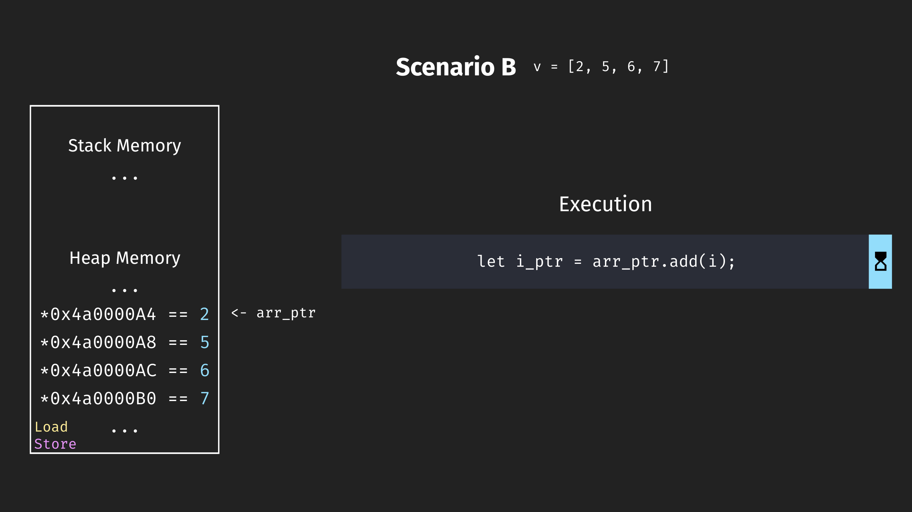

#### Optimising stable sort in Rust

and mostly failing

---

~Success 🎉~ 🚫

Failure ✅

Note: I've seen many presentations about success, and great results. Today I
want to focus on the mistakes I made while working on improving stable sort in
the Rust standard library.

---


<!-- **About myself**

- FOSS and Rust enthusiast
- Loves reading Sci-Fi
- Enjoys board games and cooking
- Terrible at whistling
- Cannot drive cars
- Works for MVTec Software GmbH

-->

Note:
MVTec software company focused on high performance, high quality machine vision.

---


<!-- **What I do at MVTec**

- An IDE focused on prototyping MV (HDevelop)
- A custom programming language
- Language interfaces (eg. HALCON/Python) -->

Note:
Conversations happening about Rust

---

**Overview**

- Basic implementation errors
<!-- .element: class="fragment" -->
- Test methodology mistakes
<!-- .element: class="fragment" -->
- A subtle issue
<!-- .element: class="fragment" -->

Note:

---

**First mistake**

Underestimating how much work this would be
<!-- .element: class="fragment" -->

---

fluxsort describes itself as:

> This document describes a hybrid mergesort / quicksort named fluxsort. The
> sort is stable, adaptive, branchless, and has exceptional performance.

Note: This journey started when I discovered
[fluxsort](https://github.com/scandum/fluxsort) a seemingly novel stable sort
implementation promising impressive performance. It claims to be faster than
pdqsort which is the pattern defeating quick sort used by Rust's
[sort_unstable](https://doc.rust-lang.org/std/primitive.slice.html#method.sort_unstable).
My hope was to port this C library to Rust and improve the standard library
stable sort with it.

---

`fluxsort.c`

- ~240 LoC
- 0 includes

Note:
- How hard could it be.
---

*How hard could it be*

- Actually 1.2k LoC
<!-- .element: class="fragment" -->
- Lines with 7 statements
<!-- .element: class="fragment" -->
- Only works for integers
<!-- .element: class="fragment" -->
- Not actually stable
<!-- .element: class="fragment" -->
- Undefined Behavior (UB)
<!-- .element: class="fragment" -->
- No panic in C
<!-- .element: class="fragment" -->

Note:
- The header includes multiple .c files
- Some lines are hardly 'single' lines
- The Rust version should be general, both in capability and performance
- Some parts to the best of my understanding and tests aren't actually stable in
  fluxsort (see unguarded_insert in the original, maybe I ported it wrong)
- Some parts of fluxsort are UB (see unguarded_insert or flux_analyze in the original)
- In C there is no notion of panics and stack unwinding. As consequence the code
  is written without panic safety in mind, if the user provided comparison
  function panics.

---

**Basic implementation mistakes**

- Incorrect port from C to Rust
- Off-by-one in unsafe code
- Many more ...

Note: I made some basic implementation mistakes, I want to zoom in on the first
one.

---

Rust (stdlib internal):

```rust
fn merge_sort<T, F>(v: &mut [T], is_less: &mut F)
where
    F: FnMut(&T, &T) -> bool,
```

C (qsort, fluxsort):

```c
typedef int CMPFUNC (const void *a, const void *b);

void FUNC(fluxsort)(VAR *array, size_t nmemb, CMPFUNC *cmp)
```
<!-- .element: class="fragment" -->

Note:

---

qsort documentation about the comparison function:

> comparison function which returns ​a negative integer value if the first
> argument is less than the second, a positive integer value if the first
> argument is greater than the second and zero if the arguments are equivalent.

Note: I needed to map these semantics onto a function which tells me as a
boolean whether one element is less than another element.

---

In essence:

```
a <  b -> -1 (negative)
a == b -> 0
a >  b -> 1 (positive)
```

---

```c
if (cmp(a, b) > 0) { // in fluxsort
```

```rust
if !is_less(a, b) { // wrong port
```
<!-- .element: class="fragment" -->

```rust
if is_less(b, a) { // correct port
```
<!-- .element: class="fragment" -->

---

```c
if (cmp(a, b) > 0) { // in fluxsort
a <  b -> -1 > 0 == false
a == b ->  0 > 0 == false
a >  b ->  1 > 0 == true
```

```rust
if !is_less(a, b) { // wrong port
a <  b -> !true  == false
a == b -> !false == true
a >  b -> !false == true
```
<!-- .element: class="fragment" -->

```rust
if is_less(b, a) { // correct port
a <  b ->           false
a == b ->           false
a >  b ->           true
```
<!-- .element: class="fragment" -->

---

**Mistake -> Effect**

I made a mistake during porting -> Sort isn't stable anymore

---

**Methodology mistakes**

- False randomness
- Bogus tests
- Benchmarking is tricky
- Bad distributions
- Many more ...

---

Benchmark result timeline:

🤩 -> 🙄 -> 🤔 -> 😳

Note: At the beginning it looked great. It looked like a good speedup, sometimes
even outperforming `slice::sort_unstable`. Then I took a pause and results
didn't look good anymore.

---

**Confusing cause and effect**

To limit the effect that modules and precompiled  
std lib had, I copied the source of the std lib  
sort into the repo and put each in a single module.

--

I also did another change, but didn't realize at the time.
<!-- .element: class="fragment" -->

---

Fixed random seed per session:
```rust
pub fn random_init_seed() -> u64 {
    static SEED: OnceCell<u64> = OnceCell::new();
    *SEED.get_or_init(|| -> u64 { thread_rng().gen() })
}

fn new_seed() -> StdRng {
    rand::SeedableRng::seed_from_u64(random_init_seed())
}
```

Basic building block for all other random test patterns:
<!-- .element: class="fragment" -->
```rust
fn random_vec(size: usize) -> Vec<i32> {
    let mut rng = rand::rngs::StdRng::from(new_seed());

    (0..size).map(|_| rng.gen::<i32>()).collect()
}
```
<!-- .element: class="fragment" -->

Note: I wanted to ensure that even though the tests were random, they could be
repeated with a fixed seed.

---

The benchmark results contradicted all  
my micro-architectural understanding.

Note: I took a pause and the results contradicted everything about modern
out-of-order superscalar processors. But I attributed the result to copying the
std library implementations.

---

`bench.rs`

```rust
b.iter_batched(
    || transform(pattern_provider(test_size)),
    |mut test_data| sort_func(test_data.as_mut_slice()),
    batch_size,
)
```

`iter_batched` -> new input each iteration.

Note: I used criterion for benchmarking, and had used `iter_batched` to get new
random test_data.

---

Wait, what exactly does fixed seed mean?

Note: I was in the process of writing up my findings, and doing further
benchmarks.

---

What I *believed* it meant:

```
seed: XX
random_vec(2) -> [1682550408, 37143093]
random_vec(2) -> [-964845353, -1369154326]
random_vec(2) -> [1119713881, 361750226]

seed: YY
random_vec(2) -> [-393481225, -1700117876]
random_vec(2) -> [1083807247, 1293089730]
random_vec(2) -> [-1137850992, -1281622637]
```

```
seed: XX
random_vec(2) -> [1682550408, 37143093]
random_vec(2) -> [-964845353, -1369154326]
random_vec(2) -> [1119713881, 361750226]
```
<!-- .element: class="fragment" -->

---

What it *actually* meant:

```
seed: XX
random_vec(2) -> [1682550408, -457304338]
random_vec(2) -> [1682550408, -457304338]
random_vec(2) -> [1682550408, -457304338]

seed: YY
random_vec(2) -> [-393481225, 1556480449]
random_vec(2) -> [-393481225, 1556480449]
random_vec(2) -> [-393481225, 1556480449]
```

---

Every benchmark, used the same numbers  
**again and again.**

---

A branchy sort with perfect branch prediction  
can out-perform a branchless sort.

---

I felt pretty dumb 😳

Note: Weeks of work and results down the drain.

---

Fix:

```rust
static USE_FIXED_SEED: AtomicBool = AtomicBool::new(true);

pub fn disable_fixed_seed() {
    USE_FIXED_SEED.store(false, Ordering::Release);
}

pub fn random_init_seed() -> u64 {
    if USE_FIXED_SEED.load(Ordering::Acquire) {
        static SEED: OnceCell<u64> = OnceCell::new();
        *SEED.get_or_init(|| -> u64 { thread_rng().gen() })
    } else {
        thread_rng().gen()
    }
}
```

---

Never again:

```rust
fn ensure_true_random() {
    let random_vec_a = patterns::random(5);
    let random_vec_b = patterns::random(5);

    // I had a bug, where the test logic for fixed seeds,
    // made the benchmarks always use the same numbers,
    // and random wasn't random at all anymore.
    assert_ne!(random_vec_a, random_vec_b);
}

fn criterion_benchmark(c: &mut Criterion) {
    patterns::disable_fixed_seed();
    ensure_true_random();
    [...]
}
```

---

**Mistake -> Effect**

I changed multiple things at once -> Wrong effect correlation

---

Benchmark dimensions:

- 5 types (i32, u64, String, 1k, f128)
- 11 patterns (random, ascending, descending_saw_5 ...)
- 27 sizes (0, 1, 2, 3, .. 19, 20 .. 101 .. 1_000_000)
- hot/cold prediction state

Note: I benchmarked with different types, patterns and sizes.

---


---


Note: These are not the final results.

---

`u64` performs like the random pattern across most patterns.

---

Transforming `i32` -> `u64`

```rust
let x = val.saturating_abs();
x.wrapping_mul(x)
```

```
[1e5, 2e5, 3e5] -> [1410065408, 1345294336, -194313216]
```
<!-- .element: class="fragment" -->

`i32` was turned into `i32` 🤦
<!-- .element: class="fragment" -->

---

Fixed:

```rust
// Extends the value into the 64 bit range,
// while preserving input order.
let x = ((*val as i64) + (i32::MAX as i64) + 1) as u64;
x.checked_mul(i32::MAX as u64).unwrap()
```

```
[1e5, 2e5, 3e5] -> [4611900764644604256, 4612115513009304256, 4612330261374004256]
```

---

Comparison statistics:

```
Percent comparisons done more by new_stable than std_stable

[i32-ascending-20-sub]:   median: 0%
[f128-ascending-20-sub]:  median: 54%
...
```

---

I know that `new_stable` does the absolute minimum  
of comparisons if the input is already sorted.

Note:
Eg. 9 comparisons for 10 elements.

---

```rust
fn partial_cmp(&self, other: &Self) -> Option<Ordering> {
    // Simulate expensive comparison function.
    (self.x / self.y).partial_cmp(other.x / other.y)
}
```

```rust
// Before
let val_abs = val.saturating_abs();

let x = val_abs as f64 + 0.1;
let y = (val_abs.saturating_add(1) as f64).log(4.1);
```

```rust
// After
let val_f = (val as f64) + (i32::MAX as f64) + 10.0;

let x = val_f + 0.1;
let y = val_f.log(4.1);
```

---

Before:

```
[0, 1, 2] -> [inf, 2.2, 2.7]
```

After:

```
[0, 1, 2] -> [141015131.53, 141015131.59, 141015131.65]
```

Note: This hit the absolute worst case for the new algorithm.

---

**Mistake -> Effect**

I wrote bad type transformations -> Bogus benchmark results

---

**Uniqueness preservation**

A subtle issue

---

**The discovery**

- My sort statistics say that new_stable does on average 3  
comparisons to sort a slice of 10 elements?!

- Tests across patterns and sizes *pass*
<!-- .element: class="fragment" -->

---

🤨

---

**This makes no sense!**

- I pour through my tests, but they seem correct.

- The sort statistics produce reasonable results for std_stable

---

Sort statistics:

```rust
#[derive(PartialEq, Eq, Debug, Clone)]
struct CompCount {
    val: i32,
    comp_count: Cell<u32>,
}
```

---

Sort statistics:

```rust
sort_mod::sort_by(&mut test_input, |a, b| {
    a.comp_count.replace(a.comp_count.get() + 1);
    b.comp_count.replace(b.comp_count.get() + 1);

    a.val.cmp(&b.val)
});

let total_comparisons: u32 = test_input
    .iter()
    .map(|c| c.comp_count.get())
    .sum() / 2;
```

---

It works for std_stable but not for new_stable.

--

What is the difference?

---

Existing function:
```rust
/// Inserts `v[0]` into pre-sorted sequence `v[1..]`
/// so that whole `v[..]` becomes sorted.
fn insert_head<T, F>(v: &mut [T], is_less: &mut F)
```

New function:
```rust
/// Inserts `v[v.len() - 1]` into pre-sorted sequence
/// `v[..v.len() - 1]` so that whole `v[..]` becomes sorted.
fn insert_tail<T, F>(v: &mut [T], is_less: &mut F)
```

---

Loop setup:

```rust
let i_ptr = arr_ptr.add(i);

let tmp = mem::ManuallyDrop::new(ptr::read(i_ptr));

if !is_less(&*tmp, &*i_ptr.sub(1)) {
    return;
}
```

---

Panic safety:

```rust
let mut hole = InsertionHole {
    src: &*tmp,
    dest: i_ptr.sub(1),
};
ptr::copy_nonoverlapping(hole.dest, i_ptr, 1);

for j in (0..(i - 1)).rev() {
    // Compare elements using user-provided is_less.
    // Track hole position and duplicate elements rightward.
    [...]
}

// `hole` goes out of scope and copies src to dest.
```

---


---



---

Diverging observation:

```rust
let i_ptr = arr_ptr.add(i);

let tmp = mem::ManuallyDrop::new(ptr::read(i_ptr));

if !is_less(&*tmp, &*i_ptr.sub(1)) {
    return;
}
```

---

Unique observation:

```rust
let i_ptr = arr_ptr.add(i);

if !is_less(&*i_ptr, &*i_ptr.sub(1)) {
    return;
}

let tmp = mem::ManuallyDrop::new(ptr::read(i_ptr));
```

---

**Mistake -> Effect**

I made a small change ->  
Surprising effect on self-modifying types

---

**Conclusion 🐛**

- It's perfectly normal and ok to make mistakes
<!-- .element: class="fragment" -->
- Attempt to falsify your assumptions
<!-- .element: class="fragment" -->
- Don't be afraid to go back and re-validate assumptions
<!-- .element: class="fragment" -->

---

Links:

- Sort repo https://github.com/Voultapher/sort-research-rs
- Talk repo https://github.com/Voultapher/Presentations
- rust-lang PR https://github.com/rust-lang/rust/pull/100856

---

Thank You ❤️

---

Questions?