**Safety** vs **Performance**

A case study of C, C++ and Rust sort
implementations.

Note:

- Computer based sorting has been a topic of discussion and optimizations for 70
  years now.
- C, C++ and Rust are all systems programming languages that allow low level
  control and efficient hardware usage.
- Where does safety even come into the picture for sort implementations?
- How does safety impact performance in this domain?

---


Note:

- FOSS contributor
- MUC++ organizer for 7 years
- Experience in building distributed systems, security critical software,
compilers, interpreters, in-memory databases and language interfaces.
- Loves reading
- Enjoys board games and cooking
- Terrible at whistling

---

**Outline**

1. Motivating example
2. Property analysis
3. Property results
4. Performance
5. Conclusion


Note:
- Here is a the schedule for this talk.
- First we'll look at a motivating example.
- Afterwards we'll examine various safety relevant properties.
- Then we'll analyze how that affects a variety of C, C++ and Rust
  implementations.
- Based on this we'll look at benchmark results and form a conclusion from
  everything we learned.

---

**Motivating example**

```cpp
static const std::unordered_map<std::string, int64_t> XX = {
    ...
};
```

Note:

- New feature developed in a compiler
- Tests pass
- CI MSAN build complains that this global object is being overwritten
- Inspect all places that use this map
- Spend days pouring over it with colleague
- At some point we give up and want to tell MSAN that it's wrong and should
  ignore that file.
- Stumble over this piece of code

---

```cpp
// Completely unrelated but in same .cpp file.
std::sort(
    v.begin(),
    v.end(),
    [](const auto& a, const auto& b) {
        return a.key <= b.key;
    }
);
```

---

```cpp
// Now fixed.
std::sort(
    v.begin(),
    v.end(),
    [](const auto& a, const auto& b) {
        return a.key < b.key;
    }
);
```

---

The standard says that's undefined behavior (**UB**).

Note:

- In practice most implementations do out-of-bounds read and write. But you may
  also get an endless loop.

---

```bash
$ g++ -std=c++20 -fsanitize=address -O3 -g main.cpp
```

```cpp
// PoC for gcc 14.2.1 (and many older versions)
#include <stdint.h>
#include <algorithm>
#include <vector>

int main() {
  std::vector<int32_t> v{10, 6, 12};

  const bool cmp_res[]{true, false, true, true, true};

  std::sort(v.begin(), v.end(), [&cmp_res, idx = 0]
      (const int32_t& a, const int32_t& b) mutable {
          return cmp_res[idx++];
      });
}
```

Note:

- A small proof of concept you can repeat yourself.

---

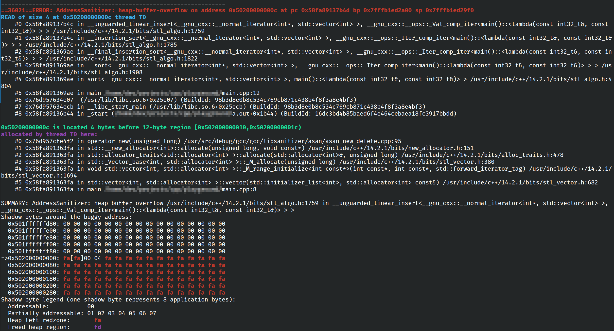

Note:

- This leads to a heap buffer overflow.
- In unguarded_linear_insert
- Of course no-one writes code like this.
- But what about this.

---

**Ordering safety**

C++:

```cpp
std::sort(v.begin(), v.end()); // Triggers UB
```

```cpp
is_same<decltype(v), std::vector<float>> // With NaNs
```
<!-- .element: class="fragment" -->

Rust:
<!-- .element: class="fragment" -->

```rust
v.sort() // compiler error
// the trait `Ord` is not implemented for `f32`
```
<!-- .element: class="fragment" -->

```rust
v.sort_by(
    |a, b| a.partial_cmp(b).unwrap_or(Ordering::Equal)
);
```
<!-- .element: class="fragment" -->

Note:

- Before we defined our own comparison function.
- What if we don't.
- Yes, this is UB.
- We never wrote our own comparison for it.
- Sorting floating point numbers can go wrong, when there are `NaN`s.
- Because any comparison with `NaN` is defined to be false by IEEE 754 their
  presence breaks the required strict weak ordering.
- Because we will also analyze the impact on Rust implementations let's look at
  that too.
- By default floating-point numbers can't be sorted in Rust because they don't
  implement a total order.
- But with some amount of "I don't care, just do it" we can get the same
  situation.
- The code does in essence do the partial comparison and if that tells me these
  elements can't be compared, just assume an equal ordering. This also breaks
  the required strict weak ordering.

---

**Side note**

```cpp
// Branchless total order for 32-bit IEEE 754 floats.
//
// negative: qNaN, sNaN, infinity, nums, subnormal nums, zero,
// positive: zero, subnormal nums, nums, infinity, sNaN, qNaN
bool f32_total_cmp(const float& a, const float& b) {
    auto left = std::bit_cast<int32_t>(a);
    auto right = std::bit_cast<int32_t>(b);

    left ^= static_cast<int32_t>(
      static_cast<uint32_t>(left >> 31) >> 1);

    right ^= static_cast<int32_t>(
      static_cast<uint32_t>(right >> 31) >> 1);

    return left < right;
}
```

Note:

- Side note.
- If you ever need a total order for `float`s that contains `NaN`s, use this
  function. 
- It's branchless and usually quite fast.
- Can be easily adapted for `double`s. Replace the 32 bit types with 64 bit
  ones, and change the 31 bit shift to 63.

---

**Exception safety**

```cpp
std::sort(v.begin(), v.end(), [](const auto& a, const auto& b) {
    if (some_condition(a, b)) {
        throw std::runtime_error{"unwind"};
    }

    return a < b;
});
```

Note:

- Let's consider this piece of code.
- Based on some condition we throw an exception in the comparison function.
- What should happen, what will happen?

---

**Exception safety**

```rust
v.sort_by(|a, b| {
    if some_condition(a, b) {
        panic!("unwind");
    }

    a.cmp(b)
});
```

Note:

- Logically the same piece of code in Rust.
- Rust mostly handles errors via a sum type called `Result` which is similar to
  `std::expected`.
- But it also has stack unwinding exceptions called panics.

---

**Exception safety**

```cpp
std::sort(v.begin(), v.end(), [](const auto& a, const auto& b) {
    if (some_condition(a, b)) {
        throw std::runtime_error{"unwind"};
    }

    return a < b;
});
```

Note:

- Back to the C++ code.
- No-one would write code like this.

---

**Exception safety**

```cpp
std::sort(v.begin(), v.end());
```

```cpp
using tag_t = std::variant<uint64_t, std::string>;

class SearchQuery {
public:
    // [...]

    bool operator<(const SearchQuery& other) const {
      return _tag < other._tag;
    }
private:
    tag_t _tag;
    // [...]
};
```
<!-- .element: class="fragment" -->

Note:

- Real world code is often way more convoluted.
- Take this `SearchQuery` implementation for example.
- The comparison can't throw, right?

---

**Exception safety**

```cpp
// 5 years later
class GPUIdx {
public:
    // [...]

    bool operator<(const GPUIdx& other) const {
        return driver_fn(_driver_handle, other._driver_handle);
    }
private:
    void* _driver_handle;
    // [...]
};
```

Note:

- 5 years later.
- A new class is added that interacts with the GPU.
- As part of the comparison function it calls a driver function.

---

**Exception safety**

```cpp
// 5 years later
using tag_t = std::variant<uint64_t, std::string, GPUIdx>;

class SearchQuery {
public:
    // [...]

    bool operator<(const SearchQuery& other) const {
      return _tag < other._tag; // May throw now.
    }
private:
    tag_t _tag;
    // [...]
};
```

Note:

- This new `GPUIdx` class is added to the `SearchQuery` tag type.
- The original author of this code has already left the company.
- What the new author doesn't realize, `driver_fn` can throw under specific
  circumstances.
- The effect is that the comparison in `std::sort` can now throw exceptions.
- Real code is probably even more convoluted.

---

**Exception safety, but which one?**

* Basic exception safety
* Strong exception safety
* Intuitive exception safety
<!-- .element: class="fragment" -->

Note:

- There are different kinds of exception safety.
- Basic exception safety guarantees that an exception does directly lead to UB.
- Strong exception safety guarantees that in the case of an exception the value
  will be rolled back to the state it was in before the operation was started.
- Strong exception safety for `std::sort` is not free for something like
  integers, it would require allocating a full buffer at the start and writing
  the original order to it and copying the elements to it.
- Impossible for a generic comparison function, as it could perform side-effects
  that can't be rolled back. E.g. doing network calls.
- Strong exception safety also runs into problems when we *want* to see the
  effects of modifications we performed.

- What we are after is intuitive exception safety. Let me explain.

---

**Exception safety**

```cpp
std::vector<std::unique_ptr<Node>> v{};
v.emplace_back(std::make_unique<Node>(/* [...] */));
v.emplace_back(std::make_unique<Node>(/* [...] */));

try {
    std::sort(v.begin(), v.end(), /*cmp fn that throws*/);
} catch (...) {
    // [...]
}

// Might cause UB with basic exception safety.
const auto first_node = *v[0];
```

Note:

- Even though we started with two valid pointers, the sort implementation can,
  and in practice does leave some elements in a moved from state if exceptions
  occur.

---

**Exception safety**

```cpp
std::vector<uint64_t> v{77, 22, 99};

try {
    std::sort(v.begin(), v.end(), /*cmp fn that throws*/);
} catch (...) {
    // [...]
}

// Valid behavior with basic exception safety.
assert(v[0] == 99);
assert(v[1] == 99);
assert(v[2] == 99);
```

Note:

- Even though we started with the values `77`, `22` and `99` in the vector `v`,
  after sorting the vector only contains the value `99`. Duplicating elements
  that are considered `trivially_copyable` is not uncommon behavior.
- And while duplicating integers doesn't directly lead to UB, if they are for
  example used as indices in an arena allocator, duplicating them could lead to
  double-free.

---

**Intuitive exception safety**

* The sort operation is seen as a series of swaps.
* Exceptions interrupt this series.
* Element order is unspecified.
* All original elements are still present.

Note:
- The intuitive understanding of what a sort does is, it swaps elements.
- An exception during a comparison interrupts the sort routine, and should leave
  the input in a state where all original element are still present and where
  the order of elements is unspecified.
- This will be the property we are testing for.

---

**Mutation safety**

```cpp
struct ValWithPtr {
    int32_t val;
    uint16_t* buffer;
};

std::sort(v.begin(), v.end(), [](auto& a, auto& b) {
    if (some_condition(a, b)) {
        a.buffer = nullptr;
    }

    return a.val < b.val;
});
```

Note:
- This compiles.
- You can define the comparison signature to take non-const references.
- cppreference tells us we are not allowed to mutate the values. But what if we
  do?
- Mutation safety, ensures that all modifications to values are observed
  after the call to `sort` concludes.
- Again, no-one writes code like this. 

---

**Mutation safety**

```cpp
union Object {
    InterpreterObj interpreter_obj;
    JITObj jit_obj;
};

using ObjectStorage =
  std::aligned_storage_t<sizeof(Object), alignof(Object)>>;
```

Note:
- Let's say we are implementing a javascript engine
- There is a generic root `Object` class that can either be the base interpreter
  object or an optimized version of the same object that was produced by a JIT.

---

**Mutation safety**

```cpp
class ObjectHandle {
public:
    ObjectHandle(Object* object) :
        _object{reinterpret_cast<uintptr_t>(object)} {}

    Val eval() const { /* [...] */ }
private:
    mutable uintptr_t _object;

    JITObj* _jit_opt_obj() const {
        return (_object >> 63) & 1
            ? reinterpret_cast<JITObj*>(_object & ~(1UL << 63))
            : nullptr;
    }
};
```

Note:

- `ObjectHandle` is a cheap to copy view-style handle to Objects.
- Internally it uses pointer tagging to promote an interpreter object to a JIT
  compiled one.

---

**Mutation safety**

```cpp
Val eval() const {
    if (auto jit_opt_obj = _jit_opt_obj()) {
        return jit_opt_obj->eval();
    }

    auto& interpreter_obj = 
        *reinterpret_cast<InterpreterObj*>(_object);
    Val val = interpreter_obj.eval();

    if (interpreter_obj.usage_count > JIT_PROMOTION_COUNT) {
         JITObj new_obj{std::move(interpreter_obj)};
         interpreter_obj.~InterpreterObj();
         new (&interpreter_obj) JITObj{std::move(new_obj)};
         _object |= 1UL << 63;
    }
    return val;
}
```

Note:

- Let's look at the `eval` function in more detail.
- Which first checks if the `Object` has been promoted to a `JITObj` and call
  that `eval` function if so.
- If not it calls `InterpreterObj::eval`.
- If a certain usage threshold is reached, the object is promoted to `JITObj`
  and the old object is destroyed and the new object constructed in-place.
- And then the pointer is tagged to mark it as containing a `JITObj`.

---

**Mutation safety**

```cpp
class EngineCtx {
public:
    EngineCtx(size_t max_obj) { _objs.reserve(max_obj); }

    ObjectHandle push_new_object() {
        assert(_obj_handles.size() < _objs.capacity());
        auto obj_data = reinterpret_cast<Object*>(_objs.data());
        new (obj_data + _obj_handles.size()) InterpreterObj{};
        _obj_handles.emplace_back(obj_data + _obj_handles.size());
        return _obj_handles.back();
    }

private:
    std::vector<ObjectStorage> _objs;
    std::vector<ObjectHandle> _obj_handles;
};
```

Note:

- Here we have the `EngineCtx` class that arena allocates objects.
- Objects always start out as `InterpreterObj`.


---

**Mutation safety**

```cpp
// If `sort` does not provide mutation safety,
// this code may lead to UB, but where and why?
void EngineCtx::sort() const {
  std::sort(_obj_handles.begin(), _obj_handles.end(),
      [](const auto& a, const auto& b) {
          return a.eval() < b.eval();
      }
  );
}
```

Note:

- The example invokes **UB**, but where and why?
- Anyone here willing to guess?
- I'll show you the slides again.

---

**Mutation safety**

```cpp
// Inside `sort`, T == ObjectHandle.
static_assert(std::is_trivially_copyable_v<T>);

// Partition with stack copy, `first` == ObjectHandle iterator.
const auto pivot = *first;
for (/* [...] */) {
    // `pivot` is promoted to JITObj
    if (*elem.eval() < pivot.eval()) { /* [...] */ }
}

// [...]

// Later `*first` is used again, it has not seen the promotion.
Val val = interpreter_obj.eval(); // Type confusion UB.
```

Note:

- Let's break it down in detail.
- The type `T` is trivially copyable, and implementations often have optimized
  code-paths for such types. Given that `ObjectHandle` is a non-owning view into
  data, it's not completely unreasonable for it to be trivially copyable.
- Let's say during partitioning or merging the sort implementation creates a
  temporary copy of the data and passes it into the user-provided comparison
  function.
- This may modify the temporary copy, and if later that place in the `vector` is
  used again, we get a particularly dangerous kind of undefined behavior.
- *Type confusion*
- The `InterpreterObj::eval` function is called with `JITObj` member state. If
  some parts of `JITObj` are user controlled, this can allow for 100% reliable
  exploits. Some of the highest scoring CVEs in existence are based on type
  confusion UB. For example the v8 javascript engine in Chrome has encountered
  it a couple of times in real world exploits.
- Type confusion is not uniquely tied to sort implementations, this is just one
  example where a big complex piece of software can run into nasty bugs because
  a stack of assumptions doesn't hold true.


---

**Mutation safety**

```rust
struct ValWithPtr {
    val: i32,
    buffer: Cell<Option<Box<[u16]>>>,
}

v.sort_by(|a, b| {
    if some_condition(a, b) {
        a.buffer.set(None);
    }

    a.val.cmp(&b.val)
});
```

Note:

- Just for reference, in Rust you can also mutate values through a const
  reference via special types like `Cell` or `Mutex`.

---

Safety properties recap

- **Ordering** safety, *what if not total order*
<!-- .element: class="fragment" -->
- **Exception** safety, *what if stack unwinding*
<!-- .element: class="fragment" -->
- **Mutation** safety, *what if element mutation*
<!-- .element: class="fragment" -->

Note:

- recap
- Properties are analyzed by a series of tests. For example a test that runs
  through a combination of input length, pattern and wrong comparison functions
  and checks for out-of-bounds accesses and if the original set of elements is
  still present.

---

**Analyzed implementations | unstable sorts**

- `c_crumsort_unstable`
- `cpp_std_gnu_unstable`
- `cpp_std_libcxx_unstable`
- `cpp_std_msvc_unstable`
- `cpp_pdqsort_unstable`
- `cpp_ips4o_unstable`
- `cpp_blockquicksort_unstable`
- `rust_crumsort_rs_unstable`
- `rust_std_unstable`
- `rust_dmsort_unstable`
- `rust_ipnsort_unstable`

Note:

- Unstable sorts will *not* preserve the order of equal elements, this allows
  for different underlying algorithms.

- crumsort is an implementation written in C by Igor van den Hoven.
- std_gnu is the libstdc++ `std::sort` implementation.
- std_libcxx is the libc++ `std::sort` implementation.
- std_msvc is the Microsoft Visual C++ `std::sort` implementation.
- pdqsort is a C++ implementation by Orson Peters derived from blockquicksort.
- ips4o is a C++ implementation that comes in two flavors, one single-threaded
  and the other using fine-grained multi-threading. The tested version is the
  single-threaded one.
- blockquicksort is a quicksort based design that popularized branchless
  partitioning by Stefan Edelkamp and Armin Weiß.
- crumsort_rs is a Rust port of crumsort, that limits itself to trivially
  copyable types, and only ports some of the logic, skipping some parts.
- rust_std is the Rust standard library `slice::sort_unstable`, vendored mid
  2022. It's more or less a port of pdqsort with some modifications.
- dmsort is a Rust implementation of the drop-merge algorithm.
- ipnsort is a Rust implementation derived from rust_std with improvements in
  portioning and the small-sort by me.

- Some unstable implementations allocate memory, for example crumsort does when
  picking the mergesort mode. The tested Rust implementations don't allocate.
- Interestingly we have two Rust implementations that are ports of C and C++
  code, crumsort_rs and rust_std.

---

**Property results | unstable sorts**

| Name                         | Functional | Generic | Ording safety | Exception safety | Mutation safety    |
|------------------------------|------------|---------|---------------|------------------|--------------------|
| c_crumsort_unstable          | ✅         | ⚠️      | 🚫            | 🚫               | 1: 🚫 2: 🚫        |
| cpp_std_gnu_unstable         | ✅         | ✅      | 🚫            | 🚫               | 1: ✅ 2: 🚫        |
| cpp_std_libcxx_unstable      | ✅         | ✅      | 🚫            | 🚫               | 1: ✅ 2: 🚫        |
| cpp_std_msvc_unstable        | ✅         | ✅      | 🚫            | 🚫               | 1: ✅ 2: 🚫        |
| cpp_pdqsort_unstable         | ✅         | ✅      | 🚫            | 🚫               | 1: ✅ 2: 🚫        |
| cpp_ips4o_unstable           | ✅         | ⚠️      | 🚫            | 🚫               | 1: 🚫 2: 🚫        |
| cpp_blockquicksort_unstable  | ✅         | ⚠️      | 🚫            | 🚫               | 1: ✅ 2: 🚫        |
| rust_crumsort_rs_unstable    | ✅         | ⚠️      | 🚫            | 🚫               | 1: -  2: -         |
| rust_std_unstable            | ✅         | ✅      | ✅            | ✅               | 1: ✅ 2: ✅        |
| rust_dmsort_unstable         | ✅         | ✅      | ✅            | ✅               | 1: ✅ 2: 🚫        |
| rust_ipnsort_unstable        | ✅         | ✅      | ✅            | ✅               | 1: ✅ 2: ✅        |

Note:

- A baseline for inclusion in this test was being functional and comparison
  based.
- crumsort being implemented in C requires the comparison function to be
  provided as a function pointer. The implementation tries to work around this
  by providing a macro comparator which is much faster. This means the usability
  is not great as you can only have a one instantiation per compilation module,
  and the default generic usage leads to poor performance.
- ips4o, blockquicksort don't support move only types.
- crumsort_rs, the Rust port of crumsort is written in a fully safe subset of
  the language. The base C implementation works only with pointers and does many
  things that would allow undefined behavior. To side-step this issue the Rust
  port limits itself to trivially destructible types. Which means it isn't
  generic.
- ips4o manages a first for C++ based implementations, by providing neither the
  first nor second kind of mutation safety.
- dmsort shows that having mutation safety and exception safety in isolation
  does not guarantee them in combination.
- Of the tested unstable sorts, none of the C and C++ based implementations
  provided ordering safety.
- rust_std and ipnsort are the only implementations that pass all tests.

---


Note:

- Interestingly, the glibc authors think that direct UB caused by a lack of
  ordering safety is a bug and should be fixed.
- qsort as of glibc 2.39 provides ordering safety.

---

**Performance**

Benchmark setup

```txt
Linux 6.5
clang version 16.0.6
gcc version 13.2.1
rustc 1.75.0-nightly (187b8131d 2023-10-03)
AMD Ryzen 9 5900X 12-Core Processor (Zen 3 micro-arch)
CPU boost enabled.
```

Note:

- Test setup when I did an initial set of measurements last year.

---

**Performance**

Input patterns

- **`ascending`** numbers `0..len`
- **`descending`** numbers `0..len` reversed
- **`random`** full random
- **`random_d20`** uniform random in the range `0..=20`
- **`random_p5`** 95% 0 and 5% random values mixed in
- **`random_s95`** 95% sorted followed by 5% unsorted
- **`random_z1`** Zipfian distribution with s == 1.0


Note:

- Modern sort implementations can do better than O(N * log(N)) if the input is
  not fully random. This adaptive behavior can have a large impact on the
  run-time.

- ascending and descending simulate already sorted inputs, happens surprisingly
  often in the real world.
- random is cryptographic quality randomness, not uniform.
- random_d20 is a low cardinality distribution.
- random_s95 simulates sort -> append -> sort.
- random_z1 is a Zipfian distribution, these are commonly known as 80/20
  distributions. Randomness in the real world looks more like this than full
  randomness.

---


Note:

- On the X-axis we have time in microseconds to sort 10_000 64-bit unsigned
  integers, lower is better.
- The Y-axis is patterns broken down by implementation.
- We see large differences between patterns caused by adaptive algorithms.
- We see large differences in run-time between implementations.
- Full random shows the longest run-times.
- It's a mixed distribution of implementation with ipnsort as the fastest.
- Overall the C++ standard implementations are the slowest ones tested, with the
  libc++ implementation being faster and exploiting patterns better.
- There are many more things we could talk about in this graph, but we'll dive
  into more details in a moment.

---

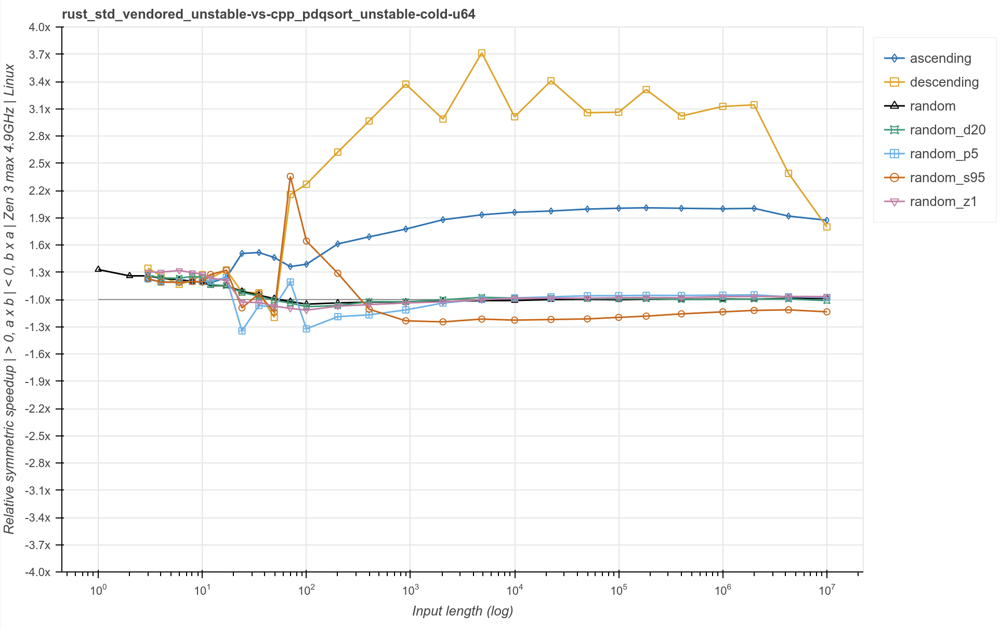

Note:

- This is a different kind of graph.
- It compares two different implementations against each other.
- It's a symmetric graph where if a point is in the upper half, the first
  implementation is faster than the other and reverse if the point is below the
  middle line.
- On the X-axis we have the input length from 0 to 10 million.
- On the Y-axis we see the relative speedup in times x. So if one implementation
  takes 100us to complete the same input length + pattern benchmark and the
  other one takes 25us, we'd get a 4x speedup.
- Each line with a set of unique symbols and color as shown in the legend
  represents one input pattern.
- Here we compare the Rust standard library unstable sort to pdqsort, which it
  is derived from.
- There are differences in the way they handle nearly sorted inputs, so let's
  filter out those patterns.

---


Note:

- We see a small difference between them at input length sub 100, which is also
  related to subtle differences in the implementations.
- But overall we see no major differences.

---

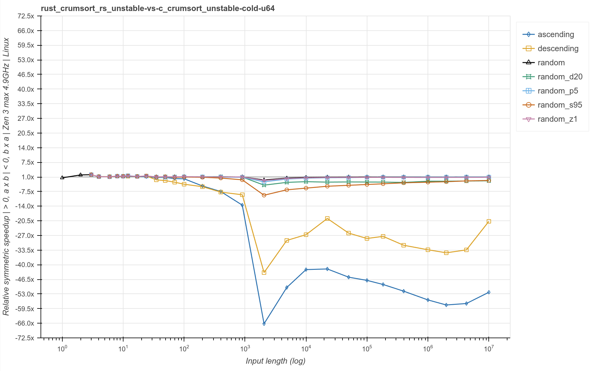

Note:

- Here we are comparing the Rust port of crumsort to the original C
  implementation.
- The big differences are caused by differences in the used algorithms.
- crumsort performs a full scan at the beginning. If the input is fully sorted,
  it's done, if it was fully reversed it reverses it. Otherwise it picks between
  mergesort and quicksort based on a heuristic.
- The Rust port does none of that and just always calls the quicksort. Which
  accounts for the large differences.

---

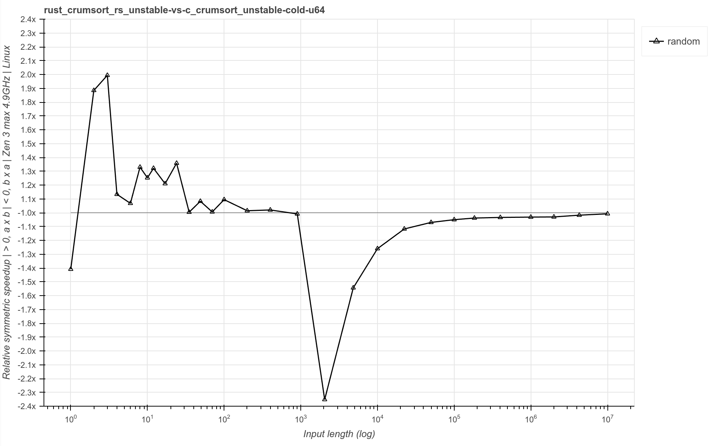

Note:

- Here we filtered out the patterns that are affected by the algorithmic
  differences.
- At input length 2048 we saw a large ~2.3x advantage of the original over the
  port. But starting at 100k we see a sub 5% difference between the two.

- So where does that leave us?
- The port that passes all safety tests is as fast the original.
- And the one that fails all of them is slower than the original.

---


Note:

- The original measurements were done about a year ago.
- Since then there has been some development.
- libc++ got an improved `std::sort` implementation.
- They also encountered the bugs caused by a lack of ordering safety and added
  compile time defines that can help catch them for debug builds.

---


- The Rust standard library also had changes to their implementations. Replacing
  both stable and unstable sort earlier this year.

---

***Performance***

Benchmark setup new

```txt
Linux 6.10
clang version 18.1.8
gcc version 14.2.1
rustc 1.83.0-nightly (f79a912d9 2024-09-18)
AMD Ryzen 9 5900X 12-Core Processor (Zen 3 micro-arch)
CPU boost enabled.
```

Note:

- Let's re-test and compare the best standard library C++ implementation with
  the Rust counterpart.
- Same machine but newer software.

---

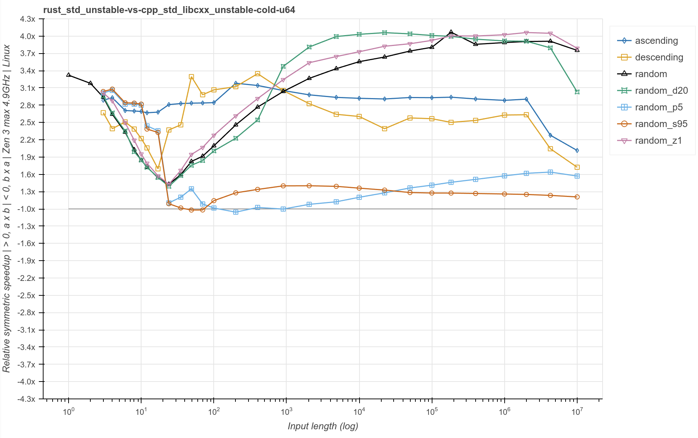

Note:

- Here we are comparing the two standard library unstable sort implementations.
- The Rust code is 3 or more times faster for most random patterns.
- Across all 200 benchmarks there are practically zero where the C++
  implementation is faster.
- Past input length 2 million, the working set no longer fits into the L3 of the
  test machine, at which point the primary bottleneck becomes main memory
  bandwidth.

---

**Correlations**

- Performance <-> usage-safety 🚫
<!-- .element: class="fragment" -->
- Performance <-> impl-safety ?
<!-- .element: class="fragment" -->
- Impl-safety <-> usage-safety 🚫
<!-- .element: class="fragment" -->
- Target audience <-> usage-safety ✅
<!-- .element: class="fragment" -->

Note:

- Today we saw that there was *no* correlation between performance and the
  effective usage-safety. The top performing implementations were either very
  safe to use and gracefully handled user mistakes and unusual usage or invoked
  UB for every kind of user mistake or unusual usage.

- There was *no* conclusive correlation between performance and the whether or
  not the sort implementations were written in a safe subset of the language.
  The fastest *and* slowest implementations were implemented in unsafe language
  subsets. There was only one implementation fully written in a safe subset
  which performed in the middle of the pack, which is not enough data to draw a
  conclusion here.

- There was *no* correlation between usage-safety and being implemented in a
  safe langauge subset. The C and C++ implementations were all implemented in
  unsafe language subsets and so were the majority of Rust implementations. The
  one Rust implementation that was implemented in a fully safe subset, can
  easily lead to UB in adjacent unsafe code. The only implementations that
  provided meaningful usage-safety were written in an unsafe subset of Rust. You
  don't need to use a safe subset to achieve safe-to-use interfaces.

- There *was* one clear correlation. If the sort implementation was written for
  C and C++ users, usage mistakes and unusual usage were greeted with UB and
  surprising behavior such as element duplication. In contrast if the
  implementation was written for Rust users, by and large usage mistakes were
  handled gracefully and unusual usage handled without issue, avoiding UB. The
  only exception is the one Rust implementation which is a logical port of the C
  based crumsort implementation.

---

**Conclusion**

- Safety and performance is *not* a zero sum tradeoff
<!-- .element: class="fragment" -->
- Safety is a question of *culture*
<!-- .element: class="fragment" -->
- Unlock performance with *research and creativity*
<!-- .element: class="fragment" -->

Note:
- Often safety and performance are characterized as a set of zero sum tradeoffs,
  yet often it's possible to find better tradeoffs who's holistic properties
  improve upon a previously seen "either or".
- Every piece of large-scale evidence points in one direction. Given the
  opportunity, humans will make mistakes.
- Using performance as justification for assuming infallible users is ironic
  when in practice C++ users get worse performance *and* usage-safety than Rust
  users.

- TODO safety

- There is a 1 to N relationship between foundational library authors and
  library users, which multiplies the impact of safe-to-use abstractions.

- Instead of gaining 2% by skipping a bounds-check, gain 200% by re-thinking the
  algorithms and data structures at play.

---

**Links**

- Presentation: https://github.com/Voultapher/Presentations
- Tests & Benchmarks: https://github.com/Voultapher/sort-research-rs

---

Thank You ❤️

---

Questions

---

Bonus

---


Note:

- Same graph as earlier comparing the time to sort 10k u64.
- Black bars are the glibc `qsort`.
- I think this comparison is unfair because it has to go through a function
  pointer interface for the comparison function, which inhibits inlining.

---

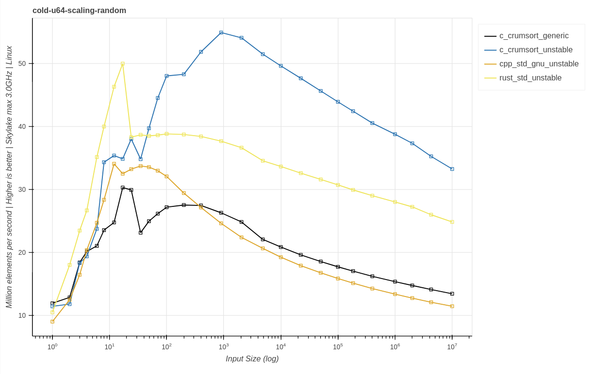

Note:

- Throughput chart for random pattern.
- crumsort but using the generic C style function pointer interface
- More than 2x slower.

---

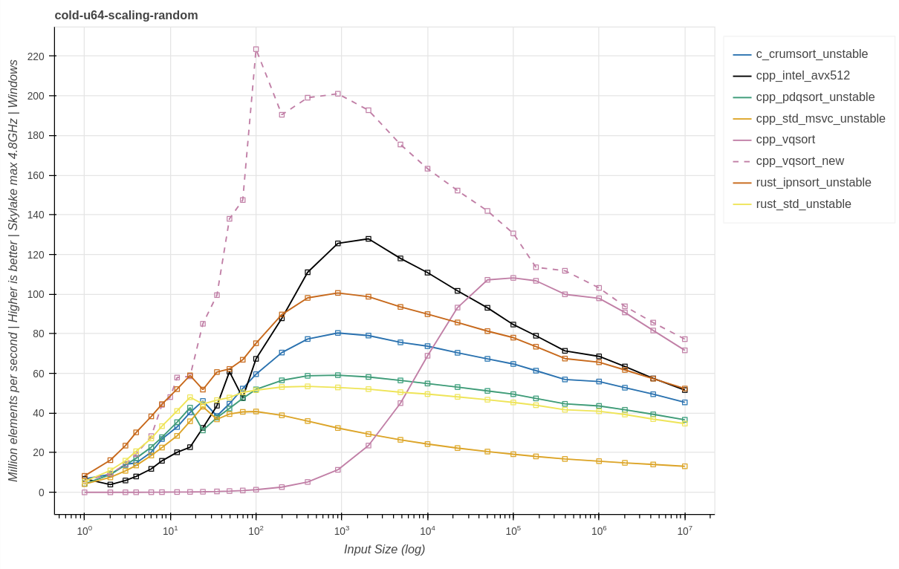

Note:

- Throughput chart for random pattern.
- AVX-512 capable Intel Skylake test machine.
- Google has a vectorized non-generic sort implementation called vqsort.
- Intel also released a vectorized quicksort, here called cpp_intel_avx512, it
  was used in numpy and OpenJDK.
- vqsort had a perf issue where it would call a syscall to get randomness for
  each sort invocation, which as disastrous for smaller input length. I reported
  that issue to the authors and they fixed it. As seen in the dotted line.
- ipnsort which is the new Rust standard library unstable sort implementation is
  in the same ballpark as the Intel implementation, despite only using SSE4
  instructions.
- The Intel implementation runs into quadratic runtime for many of the other
  patterns, so if you plan on using a non generic implementation I recommend
  using vqsort, but you must compile it with clang, gcc and msvc produce
  terrible performance. And you have to run on AVX2+ hardware.

---

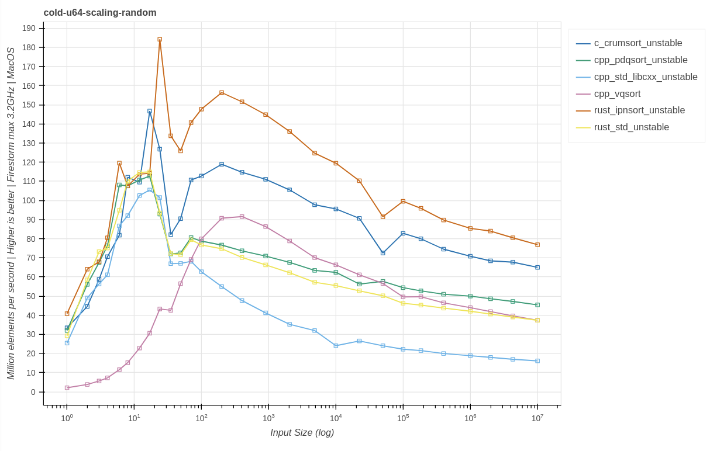

Note:

- Same throughput chart as before but on an Apple M1 pro.
- There only neon vector instructions are available.
- vqsort performs worse than crumsort and ipnsort.
- Depending on what kind of machine you are on, instruction parallel scalar code
  can be faster than using SIMD instructions.

---

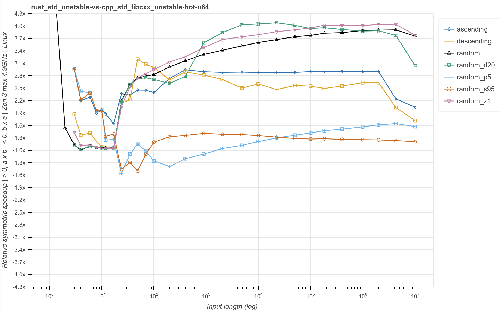

Note:

- rust_std_unstable-vs-cpp_std_libcxx_unstable-hot
- hot doesn't look all that different

---


Note:

- rust_std_unstable-vs-cpp_std_libcxx_unstable-cold
- For comparison the cold chart.

---

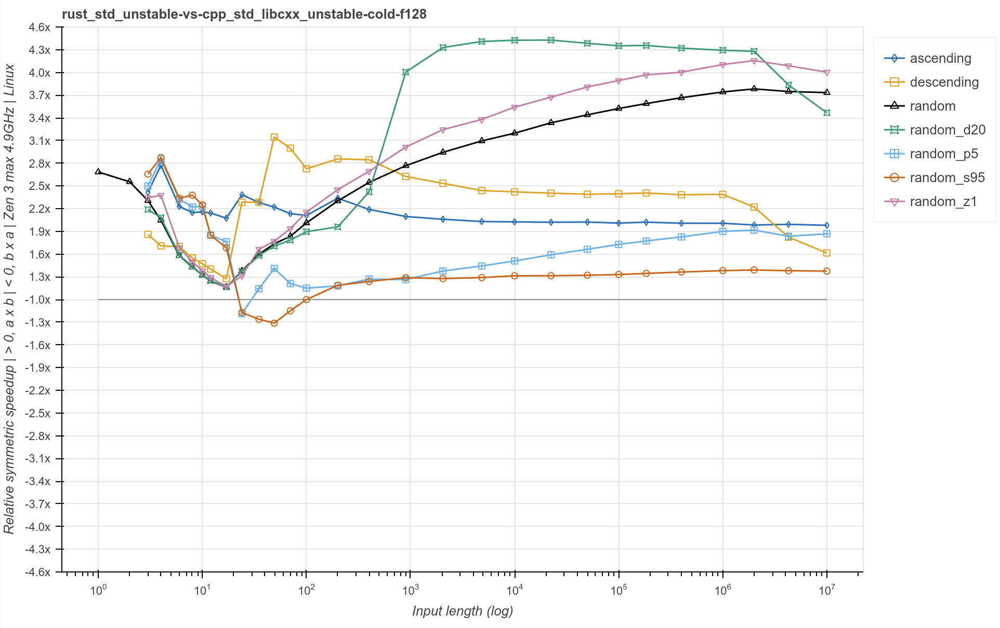

Note:

- rust_std_unstable-vs-cpp_std_libcxx_unstable-cold-f128
- Type that performs float divisions as part of comparison operator, 128 bit
  wide type.
- Similar picture to u64.

---

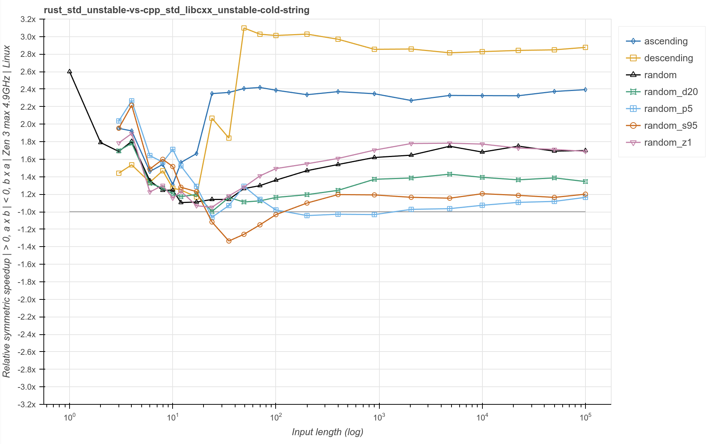

Note:

- rust_std_unstable-vs-cpp_std_libcxx_unstable-cold-string
- Fixed width string, same type for both languages, so no standard strings for
  more equal comparison.

---

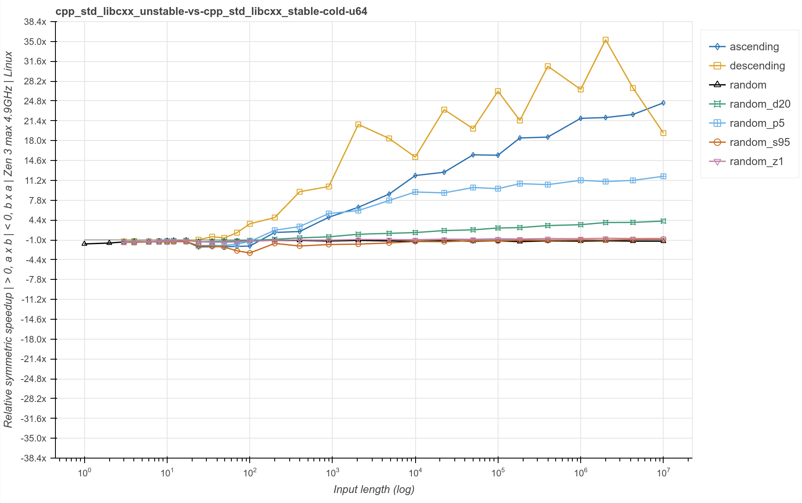

Note:

- cpp_std_libcxx_unstable-vs-cpp_std_libcxx_stable-cold-u64

---

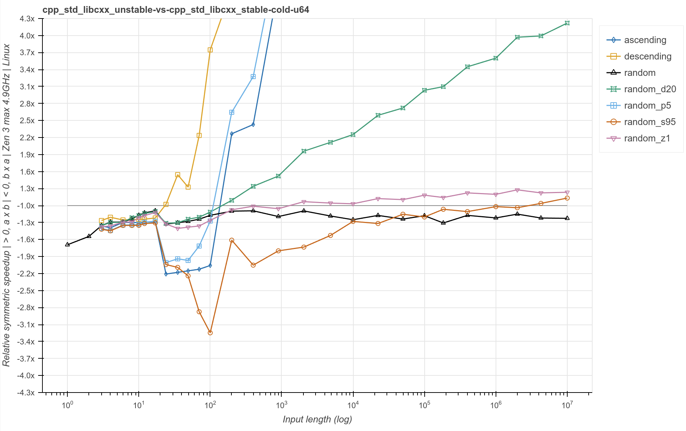

Note:

- cpp_std_libcxx_unstable-vs-cpp_std_libcxx_stable-cold-u64-clipped

---

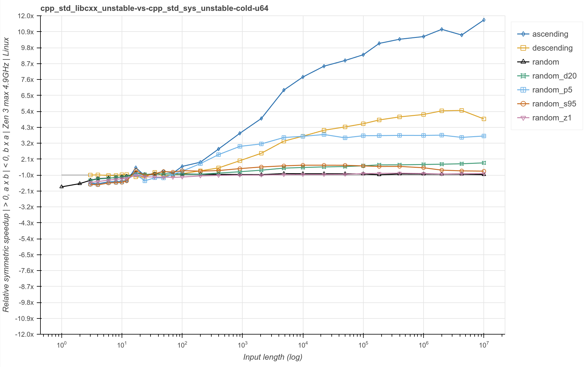

Note:

- cpp_std_libcxx_unstable-vs-cpp_std_sys_unstable-cold-u64

---

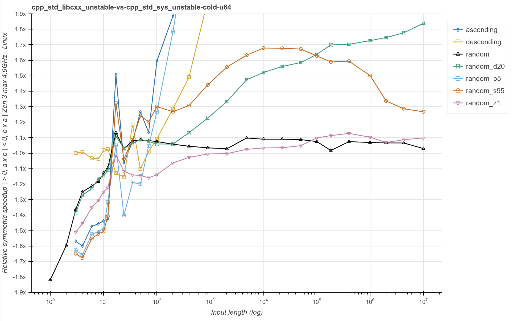

Note:

- cpp_std_libcxx_unstable-vs-cpp_std_sys_unstable-cold-u64-clipped

---

**Analyzed implementations | stable sorts**

- `c_fluxsort_stable`
- `cpp_std_gnu_stable`
- `cpp_std_libcxx_stable`
- `cpp_std_msvc_stable`
- `cpp_powersort_stable`
- `cpp_powersort_4way_stable`
- `rust_std_stable`
- `rust_wpwoodjr_stable`
- `rust_glidesort_stable`

Note:

- These are all comparison based sort implementations, so no radix or SIMD ones.
- fluxsort is an implementation written in C by Igor van den Hoven.
- std_gnu is the libstdc++ `std::stable_sort` implementation.
- std_libcxx is the libc++ `std::stable_sort` implementation.
- std_msvc is the Microsoft Visual C++ `std::stable_sort` implementation.
- powersort is a C++ implementation by the Powersort paper authors, the CPython
  implementation is based on this.
- powersort_4way is a extended version of powersort that uses more complicated
  4-way merging.
- rust_std is the Rust standard library `slice::sort`, vendored mid 2022.
- rust_wpwoodjr is a `slice::sort` derived design.
- rust_glidesort is a hybrid merge/quicksort by Orson Peters written in
  Rust.

- Pretty much all stable implementations in their tested form allocate auxiliary
  memory. This ranges from 1/8th the length of the input to the more common full
  length.

---

**Property results | stable sorts**

| Name                         | Functional | Generic | Ordering safety | Exception safety | Mutation safety    |
|------------------------------|------------|---------|-----------------|------------------|--------------------|
| c_fluxsort_stable            | ✅         | ⚠️      | 🚫              | 🚫               | 1: 🚫 2: 🚫        |
| cpp_std_gnu_stable           | ✅         | ✅      | 🚫              | 🚫               | 1: ✅ 2: 🚫        |
| cpp_std_libcxx_stable        | ✅         | ✅      | ✅              | 🚫               | 1: ✅ 2: 🚫        |
| cpp_std_msvc_stable          | ✅         | ✅      | 🚫              | 🚫               | 1: ✅ 2: 🚫        |
| cpp_powersort_stable         | ✅         | ⚠️      | ✅              | 🚫               | 1: ✅ 2: 🚫        |
| cpp_powersort_4way_stable    | ✅         | ⚠️      | ✅              | 🚫               | 1: ✅ 2: 🚫        |
| rust_std_stable              | ✅         | ✅      | ✅              | ✅               | 1: ✅ 2: ✅        |
| rust_wpwoodjr_stable         | ✅         | ✅      | ✅              | ✅               | 1: ✅ 2: ✅        |
| rust_glidesort_stable        | ✅         | ✅      | ✅              | ✅               | 1: ✅ 2: ✅        |

Note:

- A baseline for inclusion in this test was being functional and comparison
  based.
- fluxsort being implemented in C requires the comparison function to be
  provided as a function pointer. The implementation tries to work around this
  by providing a macro comparator which is much faster. This means the usability
  is not great as you can only have a one instantiation per compilation module,
  and the default generic usage leads to poor performance.
- The two powersort variants are not fully generic as they don't support move
  only types.
- In terms of ordering safety, it's a mixed bag.
- Exception safety is only found in the Rust implementations.
- Mutation safety comes in two flavors, 1. is the base one, that requires all
  modifications are visible when the sort function returns. 2. requires the same
  thing but when the comparison function throws an exception.
- The basic kind of mutation safety is given in all implementations except
  fluxsort. To be fair, C has no concept of mutation through a const object, nor
  of stack unwinding. So these issues can only occur when the code is compiled
  as C++ code.
- Only the Rust implementations pass all tests.

---


Note:

- 2023 benchmark setup.
- Similar picture to unstable, here fluxsort a C based implementation is the
  fastest.

---

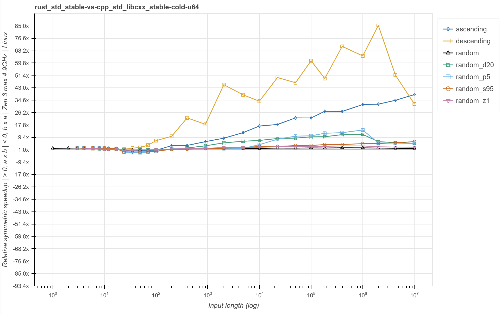

Note:

- Let's compare the stable implementations.
- That's not 85%, that's the Rust code being 85 times faster.
- Let's zoom in to see more details.

---

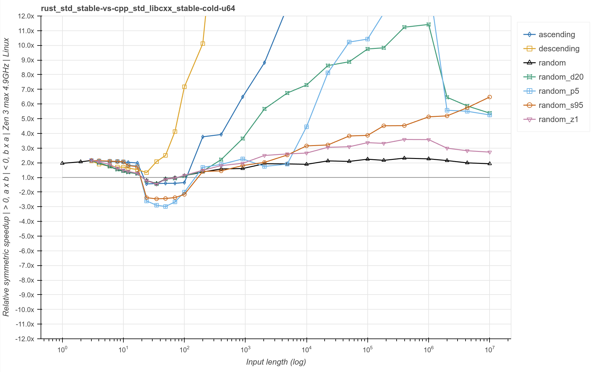

Note:

- The differences are driven by two factors, different algorithms at play and
  better use of instruction-level parallelism.
- They are running circles around us.