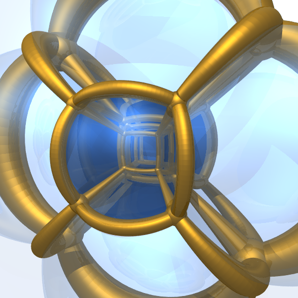
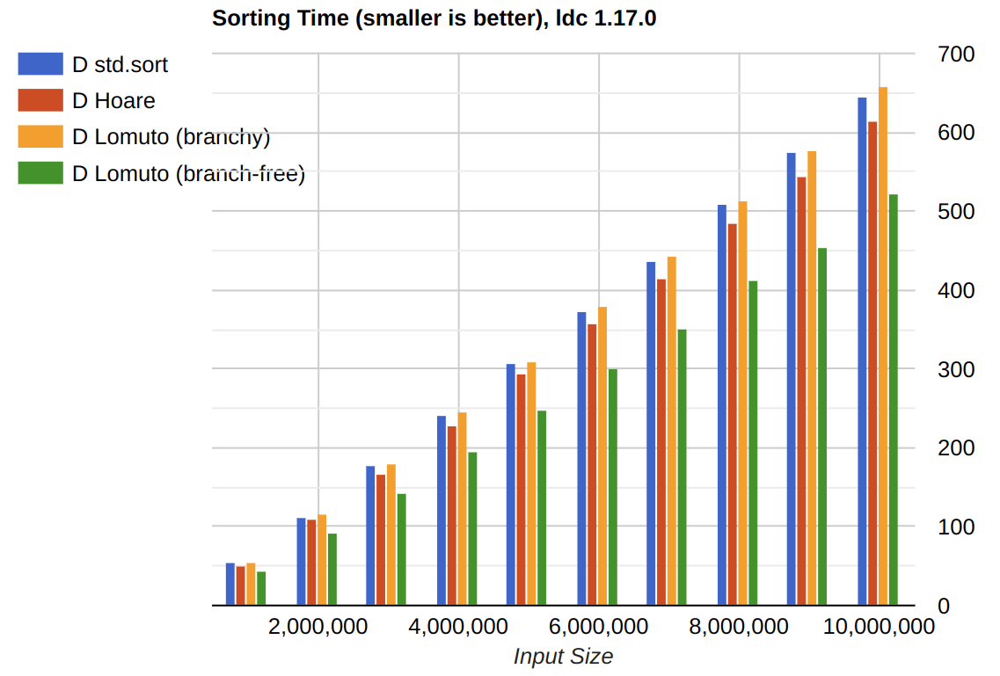
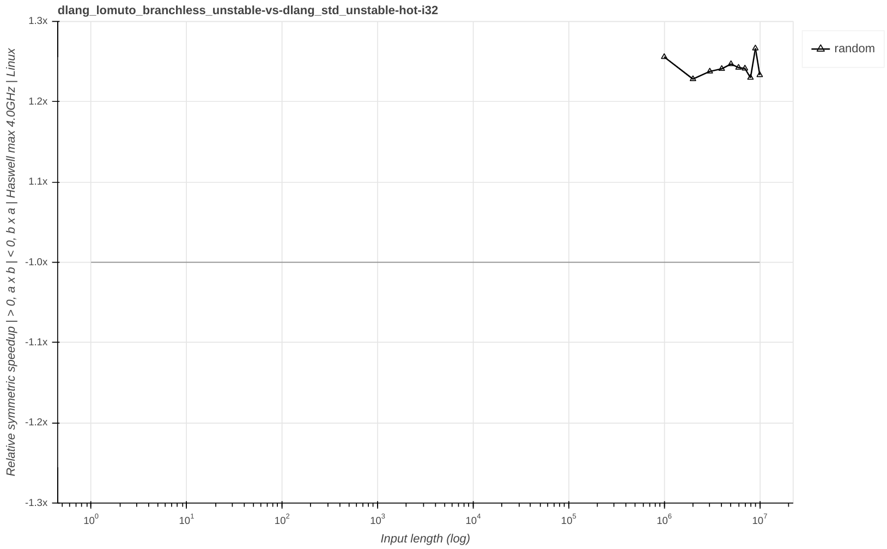
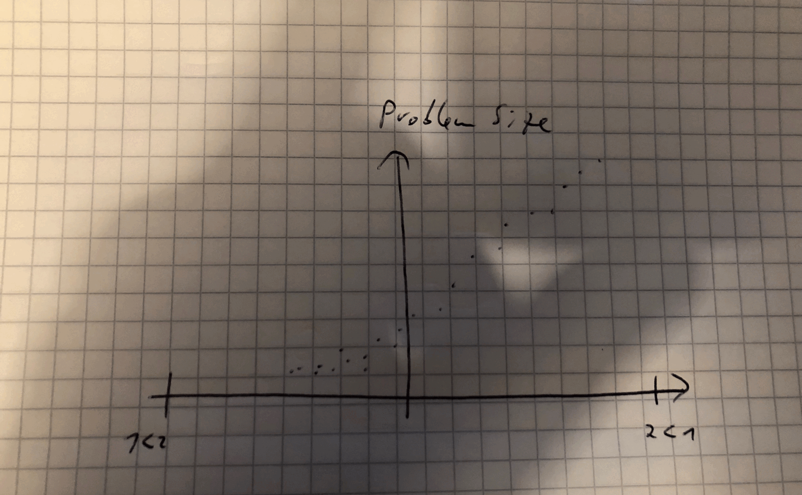
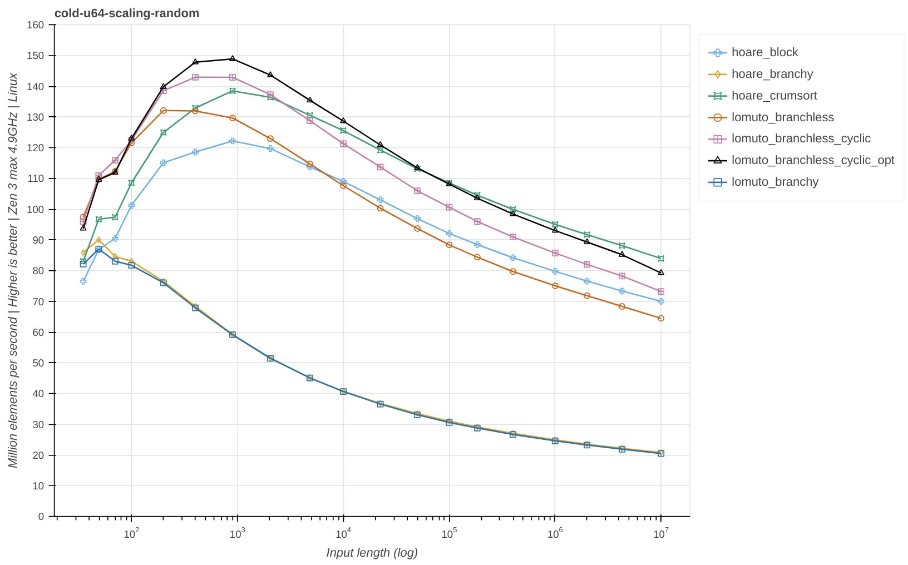
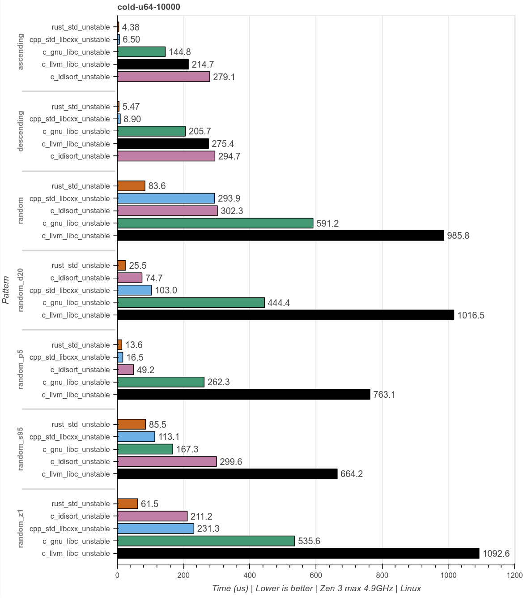

#### This thing is faster than that thing, how do I show that?

Look at my graphs.

---

**Domain**

- Sort implementation
- Adaptive hybrid algorithms
- Complex CPU micro-arch effects

Note:

- This started as an investigation into sort implementations in 2022
- I was building a test framework and also a benchmark suite
- Modern sort implementations are not a single algorithm
- They are a hybrid of multiple algorithms trying to adapt to patterns in the input
- To illuminate the different scaling effects the benchmarks measure across different dimensions
- Modern CPUs are very complex, they contain many distributed logic blocks connected by asynchronous message queues

---

**Problem space**

- Input pattern 
- Input length
- Implementation
- CPU prediction state
- Test machine

Note:

- There are multiple dimensions in the problem space
- Input pattern (e.g. random, zipfian, nearly sorted etc.)
- Input length, how many elements are we sorting
- Which implementation are we testing
- Are CPU caches hot or cold, if so which ones, L1i, L1d, BTB etc.
- What machine are we testing on

---

Note:

- Solution
- We have 5 dimensions let's just plot in 5 dimensions
- Here is a 5D cube projected onto 2D

---

**Reducing the problem space**

- Input pattern -> Pick diverse and representative ones
- Input length -> Sweep in log steps up to > L3
- Implementation -> Pick two for relative comparison
- CPU prediction state -> Separate graphs
- Test machine -> Separate graphs

Concretely 7 * 30 * 2 = ~400 data points
<!-- .element: class="fragment" -->

Note:

- By limiting the number of dimensions we look at once, we can break it down
  into a 2D problem space
- We can slice and dice this problem space into multiple different
  configurations
- I will only show a single one, but it's a good idea to experiment
- You don't need to pick only a single combination
- Specifically I want to compare two implementations
- Useful for visualizing improvements and regressions

- Concretely 7 input patterns, 30 input length steps and two implementations
  give roughly 400 data points

---

Note:
- Asked college

---

Note:
- Y axis for the problem size
- Positive X axis for implementation B is faster than A
- Negative X axis for implementation A is faster than B
- Symmetric speedup

---

Note:
- Actual data plotted
- X axis flipped around

---

Note:
- Add a mean across all points at one input length

---

Note:
- Implemented in bokeh
- Swapped X and Y axis, effectively rotating and mirroring the graph
- Instead of mean, one pattern gets a line
- Named axis with meaningful information
- Transparency to signal clusters
- Implementation improved in the meantime, most improvement
- Data points can be inspected in browser, but not as image

---

Note:
- Graphs shown as published, not the same data
- Each pattern gets a line an color
- The colors used are from "Color Universal Design (CUD)" research document. "Set of colors that is unambiguous both to colorblinds and non-colorblinds"
- Added machine info to Y axis
- X axis extended to 1e7 instead of 1e6
- Symmetric zoom, clip at +3x and -3x
- Moved line names to side outside region
- Title becomes unique continuous string, useful for automatic processing and correlation
- Patterns will change across graphs as the benchmark suite was being refined

---

Note:
- Graph is made wider
- Switch from percent to +/- x times increase. Was quite tricky, required javascript function.
- Point re-distribution in log-space, more even than before.
- Os info is added to Y axis

---

Note:
- Higher render resolution
- Each pattern gets a unique symbol to add another differentiation factor
- Colors are changed, to improve readability and differentiate lines that may be close to each other. Bright yellow avoided because of poor contrast.
- Auto-zoom based on data points, instead of +/- 3x

- (Rust only) X axis talks about input length instead of size now. Confusable concepts in Rust.

---

Note:
- Fixed unique symbol bug, random_p5 and random_z1
- Auto clip follow certain curve, generate both full and clipped graphs

---

Note:
- For comparison this is the norm
- Example, Andrei Alexandrescu writing about branchless partitioning
- Range 1 million - 10 million, presumably to get less noisy results
- Bars can only be differentiated by color
- Specific color choices can be problematic for color blind people
- Y axis is not labeled, 500 what?

---

Note:

- The same data plotted into the relative speedup graph
- Picking human friendly input sizes usually leads to over- and undersampling
- Large parts of the input space not tested at all
- Only a single pattern
- A simple bar graph is better than nothing
- But for complex adaptive algorithms they tell a very limited story

---

Note:

- All this started as an idea on a piece of paper
- Went through many iterations
- Building custom visualizations helped me understand a complex design-space
  with many tradeoffs
- Looking back it was time well spent and I'd do it again
- It's not the solution for all visualization problems
- I encourage you to carefully think about the problem domain you are in and
  what you want to benchmark at all and what kinds of data you get out of your
  benchmark runs.
- A good visualization, with bad data is still useless or even misleading
- Benchmarking is **hard**

---

Links:

- Code repo https://github.com/Voultapher/sort-research-rs
- Talk repo https://github.com/Voultapher/Presentations
- Colorblind friendly palette  
https://jfly.uni-koeln.de/color/#pallet

---

Thank You ❤️

---

Questions?

---

Bonus

---

Note:
- Comparison for multiple at the same time
- Single size

---

Note:
- Comparison for multiple at the same time
- Single pattern