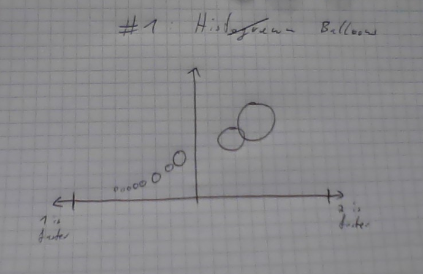
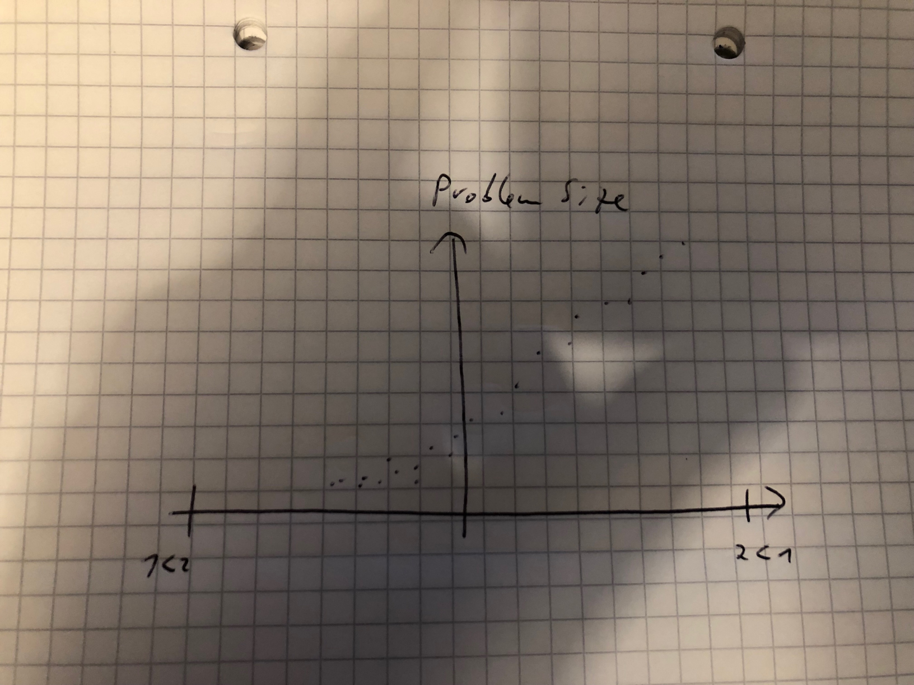
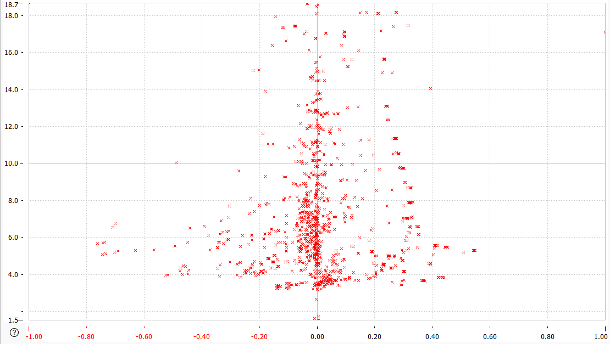
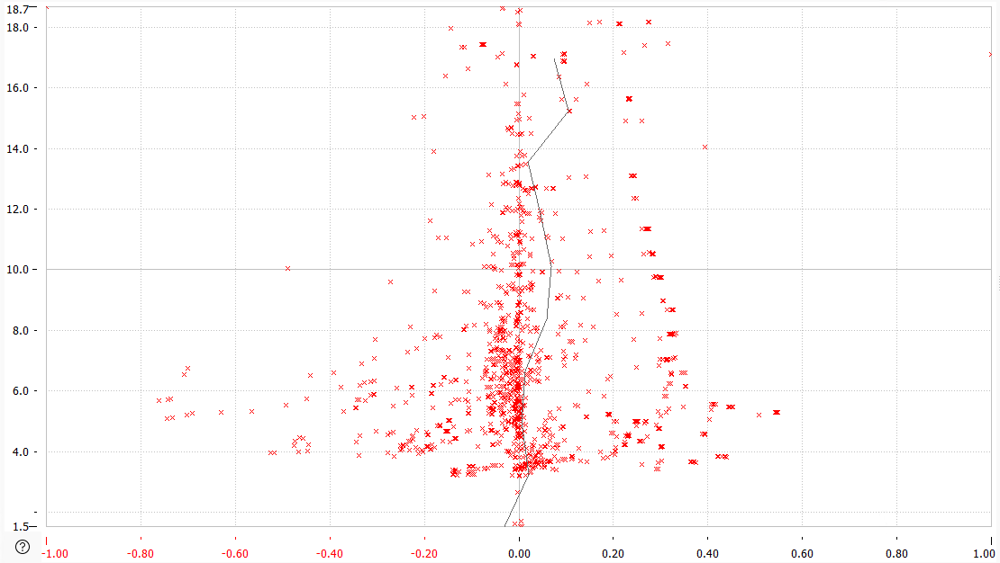
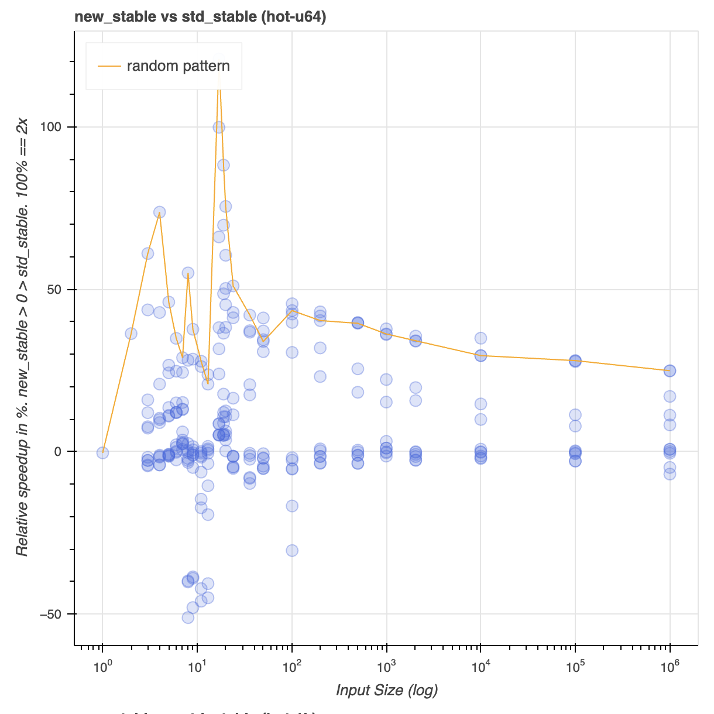
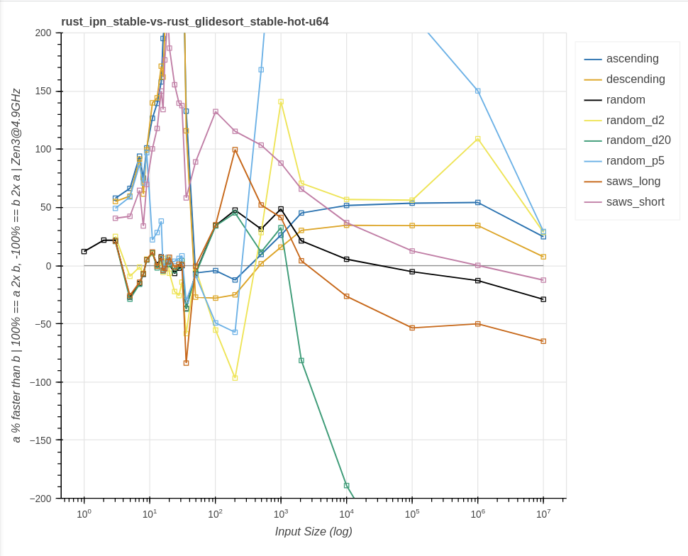
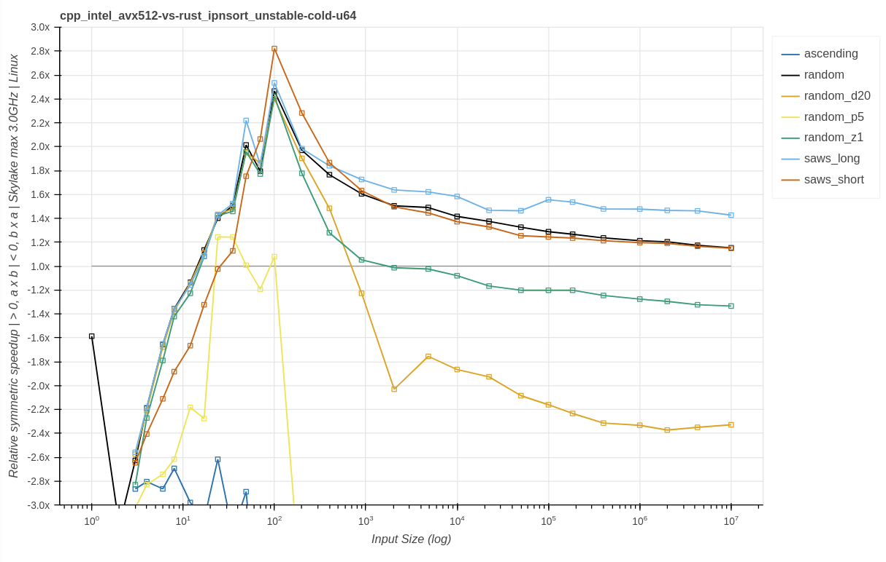
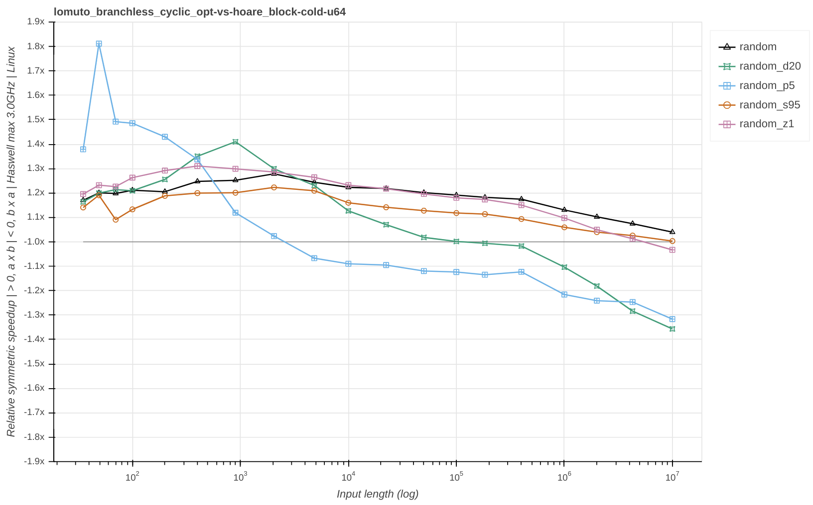
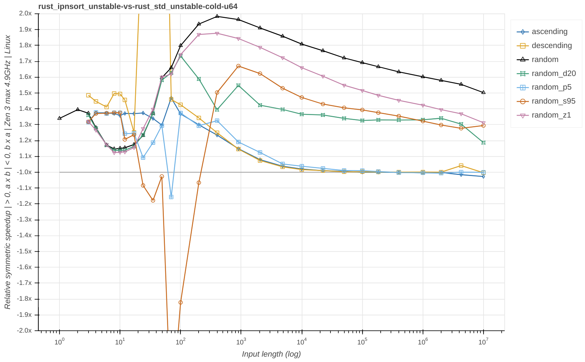

#### This thing is faster than that thing, how do I show that?

Look at my graphs.

---

TODO maybe music? Change FOSS and Rust enthusiast.

<!-- **About myself**

- FOSS and Rust enthusiast
- Loves reading Sci-Fi
- Enjoys board games and cooking
- Terrible at whistling
- Cannot drive cars
- Works for MVTec Software GmbH

-->

---

TODO meme, this one thing vs that other thing.

Note:
- TODO

---

TODO describe the domain and emphasize how much data this is. Especially across machines.

---

Note:
- Asked college

---

Note:
- Y axis for the problem size
- Positive X axis for implementation B is faster than A
- Negative X axis for implementation A is faster than B
- Symmetric speedup

---

Note:
- Actual data plotted
- X axis flipped around

---

Note:
- Add a mean across all points at one input length

---

Note:
- Implemented in bokeh
- Swapped X and Y axis, effectively rotating and mirroring the graph
- Instead of mean, one pattern has gets a line
- Named axis with meaningful information
- Transparency to signal clusters
- Implementation improved in the meantime, most improvement
- Data points can be inspected in browser, but not as image

---

Note:
- Graphs shown as published, not the same data
- Each pattern gets a line an color
- The colors used are from "Color Universal Design (CUD)" research document. "Set of colors that is unambiguous both to colorblinds and non-colorblinds"
- Added machine info to Y axis
- X axis extended to 1e7 instead of 1e6
- Symmetric zoom, clip at +3x and -3x
- Moved line names to side outside region
- Title becomes unique continuous string, useful for automatic processing and correlation
- Patterns will change across graphs as the benchmark suite was being refined

---

Note:
- Graph is made wider
- Switch from percent to +/- x times increase. Was quite tricky, required javascript function.
- Point re-distribution in log-space, more even than before.
- Os info is added to Y axis
- Machine info now says max frequency, as the measurement data doesn't tell us current frequency.

---

Note:
- Higher render resolution
- Each pattern gets a unique symbol to add another differentiation factor
- X axis talks about input length instead of size now. Confusable concepts in Rust.
- Colors are changed, to improve readability and differentiate lines that may be close to each other. Bright yellow avoided because of poor contrast.
- Auto-zoom based on data points, instead of +/- 3x
- Small input length not relevant here

---

Note:
- Fixed unique symbol bug, random_p5 and random_z1
- Auto clip follow certain curve, generate both full and clipped graphs

---

Visual recap TODO gif?

Say where each one showed up. With date?

---

Links:

- Sort research repo https://github.com/Voultapher/sort-research-rs
- Talk repo https://github.com/Voultapher/Presentations

---

Thank You ❤️

---

Questions?